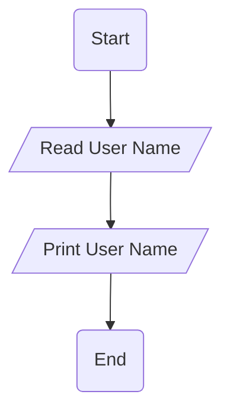

## Problem 02

> ### Write a program to ask the user to enter his/her name and print it on screen

### Steps: 
**Step 1:** Read user Name. 
**Step 1:** Print User's Name. 

### Flowchart: 

```mermaid
flowchart TD
    A(Start) --> B[/Read User Name/]
    B --> C[/Print User Name/]
    --> E(End)
```