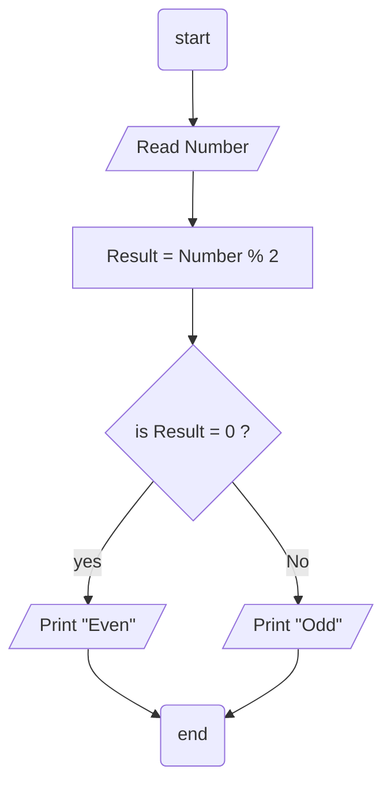

## Problem 03

> ### Write a program to ask the user to enter a number then Print "ODD" if its odd, Or "Even" if its even.

### Steps: 
**Step 1:** Read Number. 
**Step 2:** Result = Number % 2 = 0. 
**Step 3:** check ,if Result = 0 its even otherwise its odd . 
**Step 4:** Print `ODD` or `Even`. 

## Flowchart

