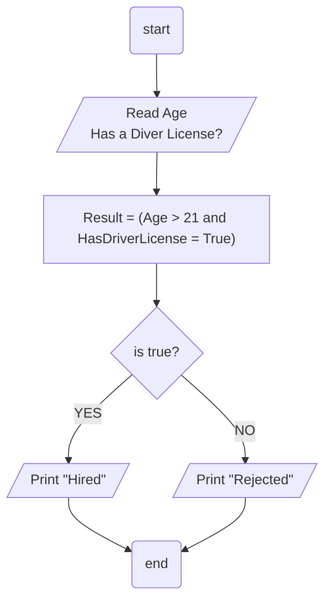

## Problem 04

>### Write a program to ask the user to enter his/her:
>- Age
>- Driver License
>Then Print `Hired` if his/her age is grater than 21 & s/he has a driver license, otherwise Print `Rejected`.
	

### Steps: 
**Step 1:** Ask the user enter his age. 
**Step 2:** Ask the user if has license. 
**Step 3:** `Result = (Age > 21 and HasDriverLicense = True)`. 
**Step 4:** Check the result if true its `Hired` otherwise its `Rejected`.  
**Step 5:** Print `Hired` or `Rejected` acording the result. 

## Flowchart

