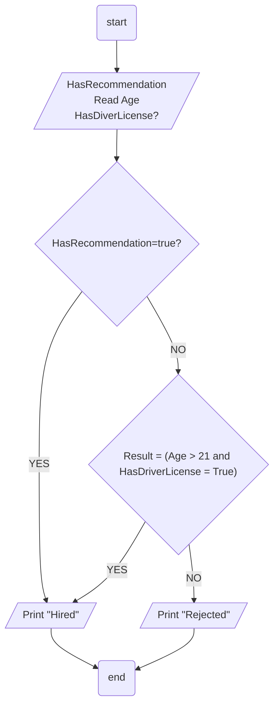

## Problem 05

>### Write a program to ask the user to enter his/her:
>- Age
>- Driver License
>- Has Recommendation
>Then Print `Hired` if his/her age is grater than 21 & s/he has a driver license, otherwise Print `Rejected` Or Hire him\her without condtions.
	

### Steps: 
**Step 1:** Ask the user if has Recommendation. 
**Step 2:** Ask the user enter his age. 
**Step 3:** Ask the user if has license. 
**Step 4:** `Result = (Age > 21 and HasDriverLicense = True)`. 
**Step 5:** Check the result if true or HasRecommendation its `Hired` otherwise its `Rejected`.  
**Step 6:** Print `Hired` or `Rejected` acording the result. 

## Flowchart

