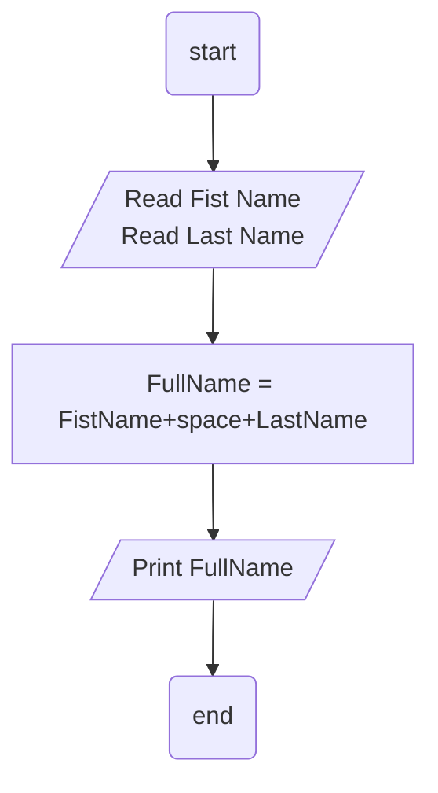

## Problem 06

>### Write a program to ask the user to enter:
>• First Name					 
>• Last Name					 
>Then Print Full Name on screen. 
>
>Example `Input`:					 
>Mohammed						 
>Abu Hadhoud					 
>
>`Output` →	Mohammed Abu-Hadhoud	

 

### Steps:
**Step 1:** Read First Name.	 
**Step 2:**	Read Last Name 
**Step 3:** Joining the First Name with Last Name (FullName = FirstName+space+LastName)	 
**Step 4:**	Print The Result 

## Flowchart

