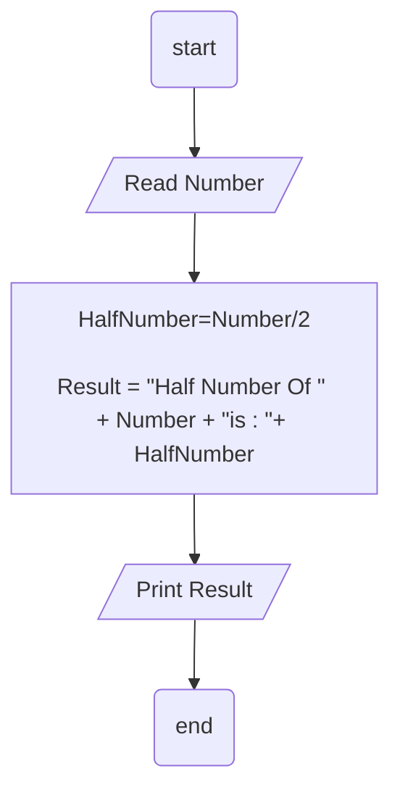

## Problem 07

>### Write a program to ask the user to enter:
>- Number
><br>Then Print the "Half" of the [Number] is [???].
><br>Exemple `Inputs`: <br>
-60<br>
	-50
> <br> `Outputs` -> 
>```
>Half of 60 is 30
>Half of 50 is 25
>```


### Steps:

**Step 1:** Read Number<br>
**Step 2:** HalfNumber = Number /2<br>
**Step 3:** Result = "Half Number Of " + Number + "is : "+ HalfNumber
**Step 4:** Print Result.

### Flowchart 



<br>
<br>

---
*Anas Chetoui* ``@anaschetoui``