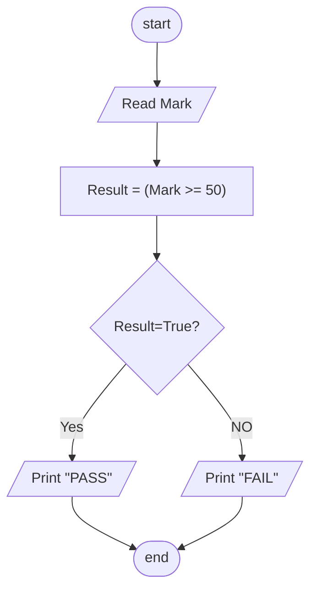

## Problem 08

>### Write a program to ask the user to enter:
> - Mark 
>#### Then Print the `PASS` if mark >=50, otherwise print `FAIL`
> Exemple `Inputs`
>>45  
>
> `Outputs` ->
>>Fail
> 
 

### Steps:

**Step 1:** Read Mark.  
**Step 2:** Result = (Mark >= 50) 
**Step 3:** check result if true print `PASS` otherwise `Fail` 
**Step 4:** Print Result   

### Flowchart 

