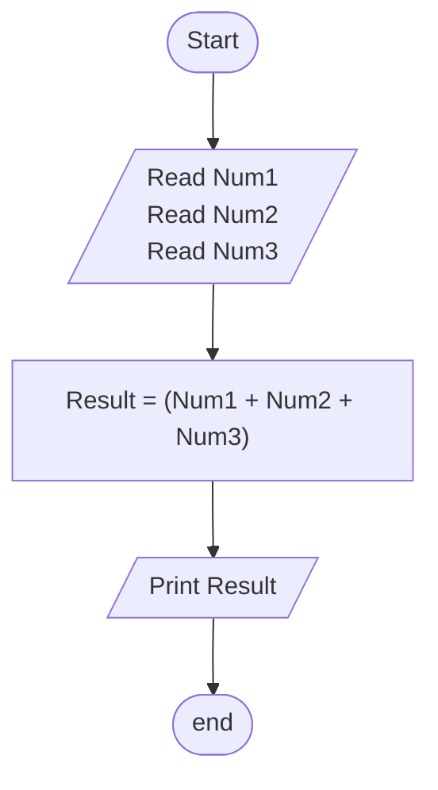

## Problem 09

>### Write a program to ask the user to enter:
> - Number1, Number 2, Number 3  
>### Then Print the Sum of entered numbers 
>Example Inputs: 
>10 
>20 
>30 
>Outputs→ 
>60  

### Steps: 

**Step 1:** Read Num1 
**Step 2:** Read Num2 
**Step 3:** Read Num3 
**Step 4:** Result = Num1+Num2+Num3 
**Step 5:** Print Result 

### Flowchart

