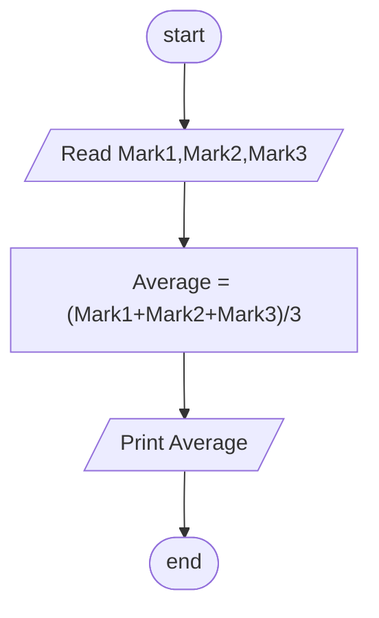

## Problem 10

>### Write a program to ask the user to enter:
> - Mark1,Mark2,Mark3
>### Then Print the Average of entered Marks
>Exemple Inputs:
>- 90 
>- 80 
>- 70 
> 
>Outputs ->
>- 80

### Steps

**Step 1** Ask user enter Mark1,Mark2,Mark3 
**Step 2** Average = (Mark1 + Mark2 + Mark3)/3  
**Step 3** Print the Average 

### Flowchart

