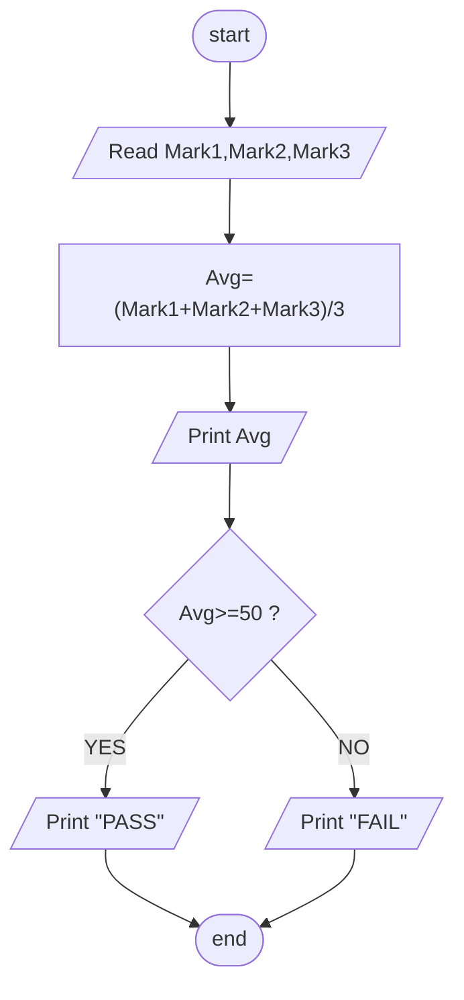

## Problem 11

>### Write a program to ask the user to enter:
> - Mark1,Mark2,Mark3
>### Then Print the Average of entered Marks,and print "PASS" if average>=50, otherwise print "FAIL"
>Exemple Inputs:
>- 90 
>- 80 
>- 70 
> 
>Outputs ->
>- 80
>- PASS

### Steps

**Step 1** Ask user enter Mark1,Mark2,Mark3 
**Step 2** Average = (Mark1 + Mark2 + Mark3)/3  
**Step 3** Print Average  
**Step 4** check if (Average >=50) = true  
**Step 5** Print PASS or FAIL based on the Result

### Flowchart

