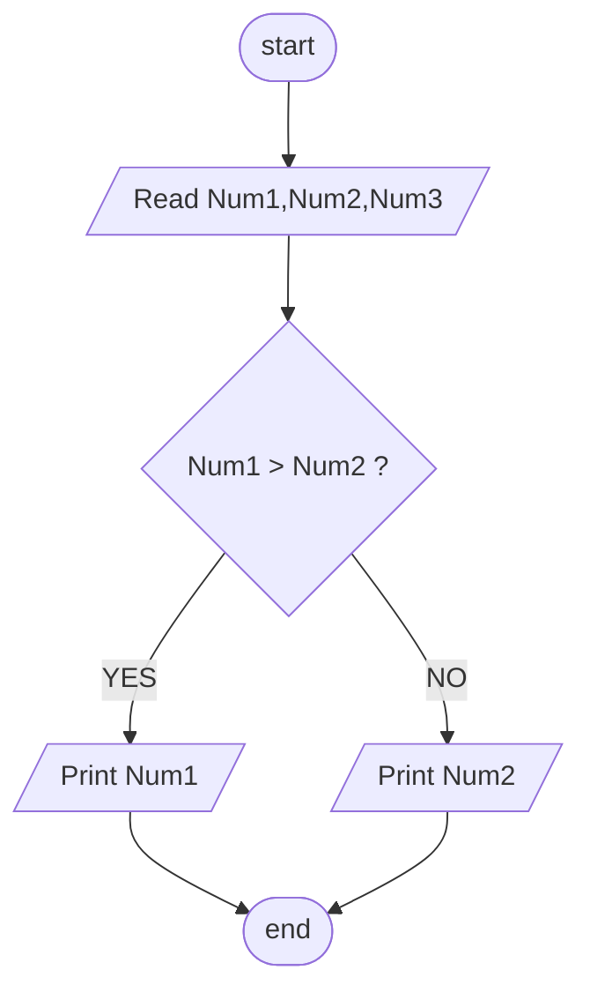

## Problem 12

>### Write a program to ask the user to enter:
>- Number1,Number2
>### Then Print the Max Number
>Exemple Inputs:
>  10
>  20
> 
> 
>Outputs ->  
>20

## Steps

**Step 1:** ask user to enter Num1,Num2.  
**Step 2:** Check Num1 > Num2If Yes Num1 is the max,otherwise Num2 is the max.   
**Step 3:** Print Max Number based on result.  

## Flowchart 

