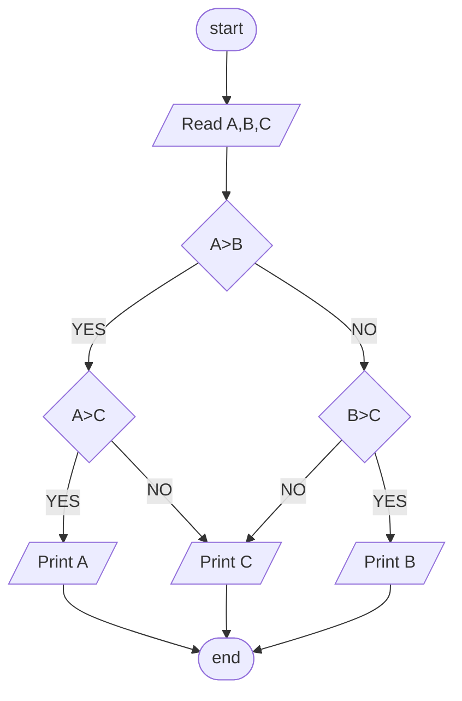

## Problem 13

>### Write Program to ask user to enter 3 Numbers:
>- A  
>- B  
>- C  
>### Then Print Max Number.
>Exemple Inputs:  
> 30 
> 10 
> 20 
> 
>Outputs ->  
> 30

### Steps

**Step 1:** Read A,B,C   
**Step 2:** A>B>C -> A Max Number A < B > C -> Max Number is B otherwise is C.    
**Step 3:** Print Max Number Accordingly  

### Flowchart

