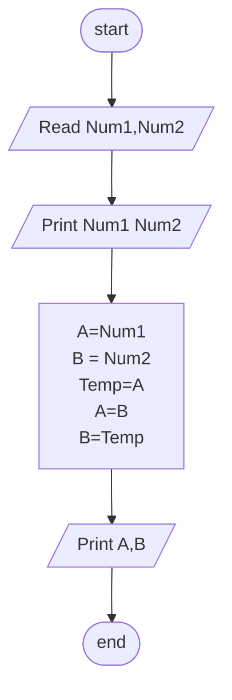

## Problem 14

>### Write a program to ask the user to enter:
>- Number1  
>- Number2  
>### Then Print the two numbers, then swap the two numbers and print them.
>Exeple Inputs:  
>- 10
>- 20
> 
>Outputs->
>- 10
>- 20
>    
>- 20
>- 10
	

### Steps

**Step 1:** Read Num1,Num2 
**Step 2:** Print Num1 
**Step 3:** Print Num2 
**Step 4:** Temp=Num1 
**Step 5:** Num1=Num2 
**Step 6:** Num2=Temp 
**Step 7:** Print Num1 
**Step 8:** Print Num2 

## Flowchart

