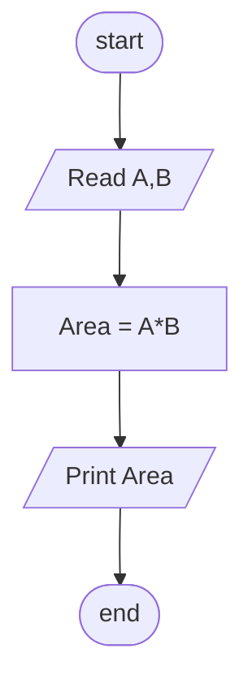

## Problem 15

>### Write a program to calculate rectangle area and print it on the screen.
>Exemple Inputs:
>- 10
>- 20  
>
>Outputs ->
>- 200

### Steps

**Step 1:** Ask the user to enter A , B 
**Step 2:** Area=A*B  
**Step 3:** Print Area  

### Flowchart

