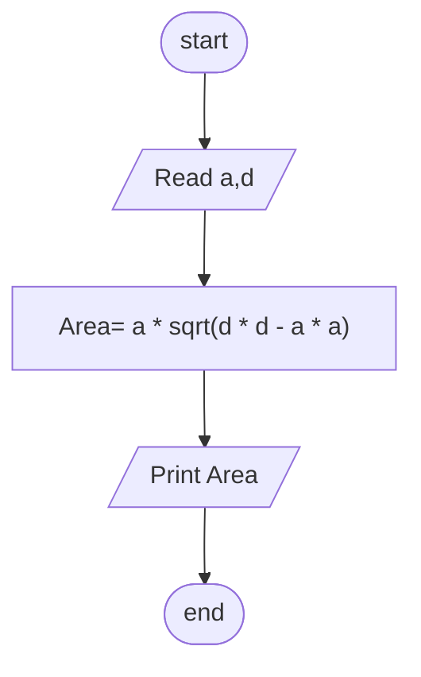

## Problem 16

>### Write a program to calculate rectangle area through diagonal and side area of rectangle and print it on the screen.
>Exemple Inputs:
>- 5 (a)
>- 40 (d) 
>
>Outputs ->
>- 198.431

### Steps

**Step 1:** Ask the user to enter a , d 
**Step 2:** Area= a * sqrt(d * d - a * a)  
**Step 3:** Print Area  

### Flowchart

