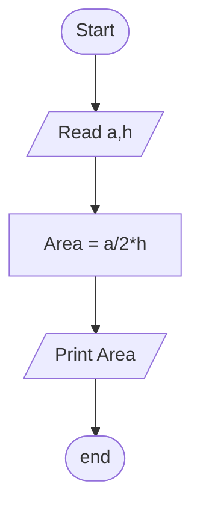

## Problem 17

>### Write a program to calculate triangle area then print it on the screen.
>The user shoud enter:
>- a
>- h
>
>*Exemple Inputs:*
>-10
>- 8
>
>*Outputs ->* 
>- 40

### Steps
**Step 1:** Read a,h 
**Step 2:** Area = a/2*h 
**Step 3:** Print Area 

### Flowchart 

