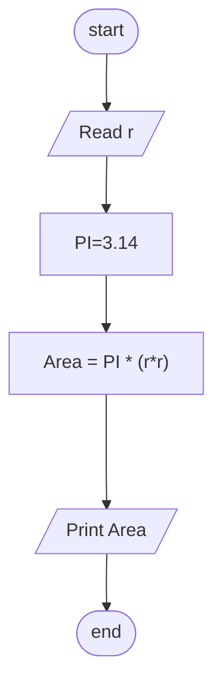

## Problem 18

>### Write a program to calculate circle area then print it on the screen.
> ### The user should enter
>- **r**
>#### Exemple Inputs:
>5
>#### Outputs ->
>78.54

### Steps

**Step 1:** Ask the user to enter r 
**Step 2:** PI=3.14  
**Step 3:** Area= 3.14 * (r*r) 
**Step 4:** Print Area  

### Flowchart

