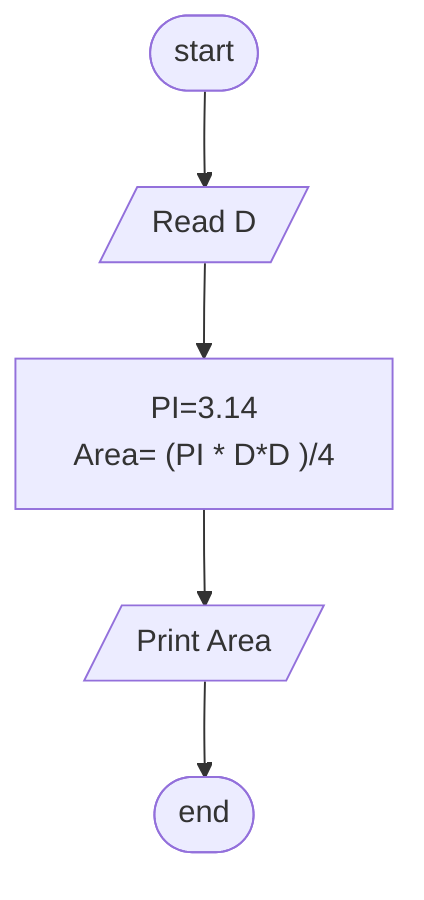

## Problem 19

>### Write a program to calculate circle area through diameter, then print it on the screen.
> ### The user should enter:
>- D
>#### Exemple Inputs:
>- 10
>#### Outputs ->
>78.54

### Steps

**Step 1:** Ask the user to enter D  
**Step 2:** PI=3.14 
**Step 3:** Area=  (PI * D*D )/4 
**Step 4:** Print Area. 

## Flowchart

