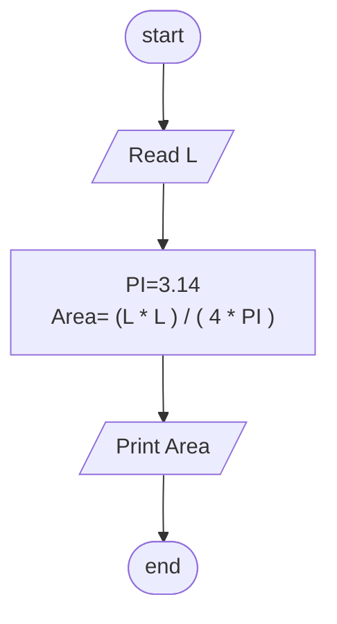

## Problem 21

>### Write a program to calculate circle area along the circumference, then print it on the screen.
> ### The user should enter:
>- L
>#### Exemple Inputs:
>- 20
>#### Outputs ->
>31.831

### Steps

**Step 1:** Ask the user to enter L  
**Step 2:** PI=3.14 
**Step 3:** Area=  (L * L)/(4 * PI) 
**Step 4:** Print Area. 

## Flowchart

