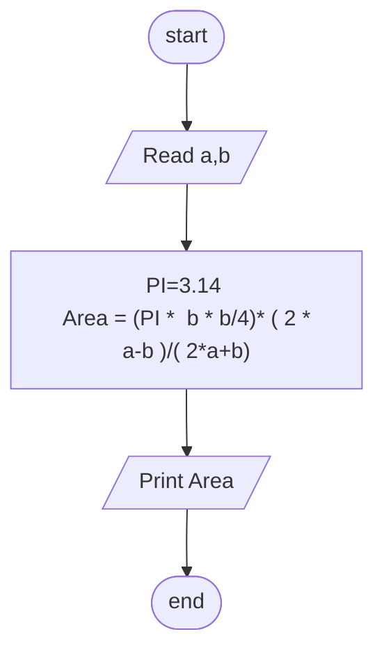

## Problem 22

>### Write a program to calculate circle area Inscribed in an Isosceles Triangle, then print it on the screen.
> ### The user should enter:
>- a
>- b
>#### Exemple Inputs:
>- 20
>- 10
>#### Outputs ->
>47.124

### Steps

**Step 1:** Ask user to enter a,b  
**Step 2:** PI=3.14  
**Step 3:**  Area = (PI * b * b/4) * (2* a-b)/(2* a+b) 
**Step 4:**  Print Area 

### Flowchart

