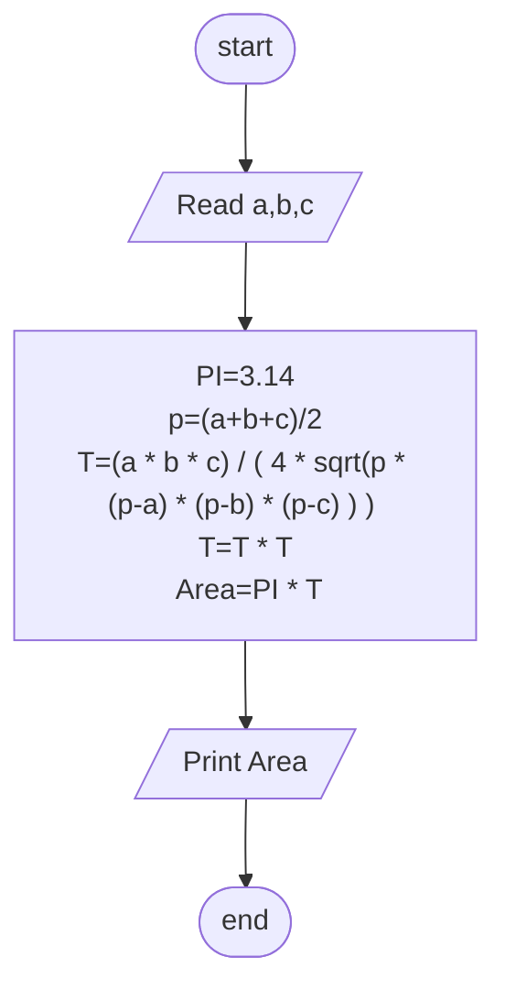

## Problem 23

>### Write a program to calculate circle area circle described around an arbitrary triangle, then print it on the screen.
> ### The user should enter:
>- a
>- b
>- c
>#### Exemple Inputs:
>- 5
>- 6
>- 7
>#### Outputs ->
> 40.088

## Steps
**Step 1:** Ask user to enter a,b,c  
**Step 2:** PI=3.14  
**Step 3:** p = (a+b+c)/2  
**Step 4:** T=(a * b * c) / ( 4 * sqrt(p * (p-a) * (p-b) * (p-c)))  
**Step 5:** T= T * T  
**Step 6:** Area = PI * T  
**Step 7:**  Print Area 

### Flowchart

