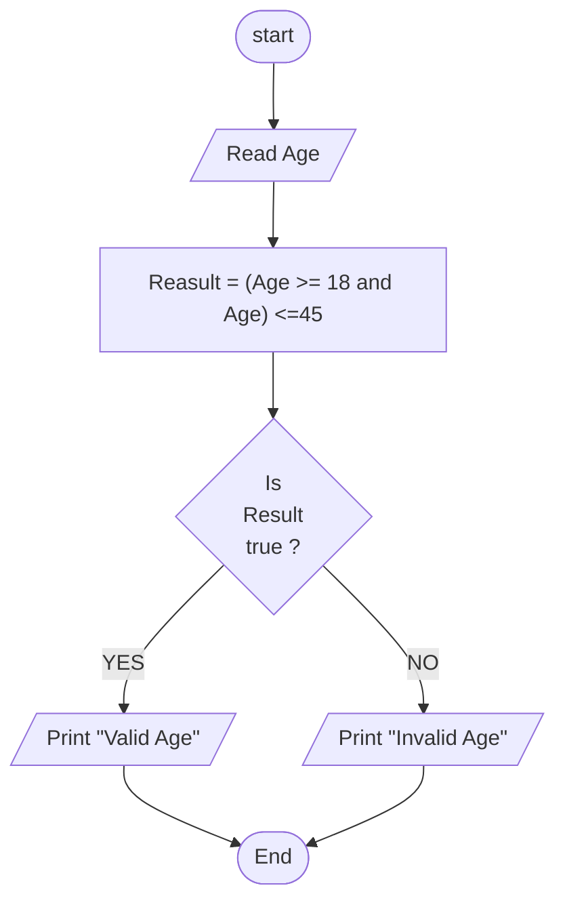

## Problem 24

>### Write a program to ask the user to enter:
> - Age  
> If age is between 18 and 45 print "Valid Age" otherwise Print "Invalid Age"  

>#### Exemple Inputs:
> 17

>#### Outputs ->
> Invalid Age

## Steps
**Step 1:**	Read the Age   
**Step 2:**	Result = (Age >= 18 and Age <=45)   
**Step 3:**	Check if result = true then its valid age otherwise its invalid   
**Step 4:**	 Print "Valid Age" or "Invalid Age" accordingly  

### Flowchart

