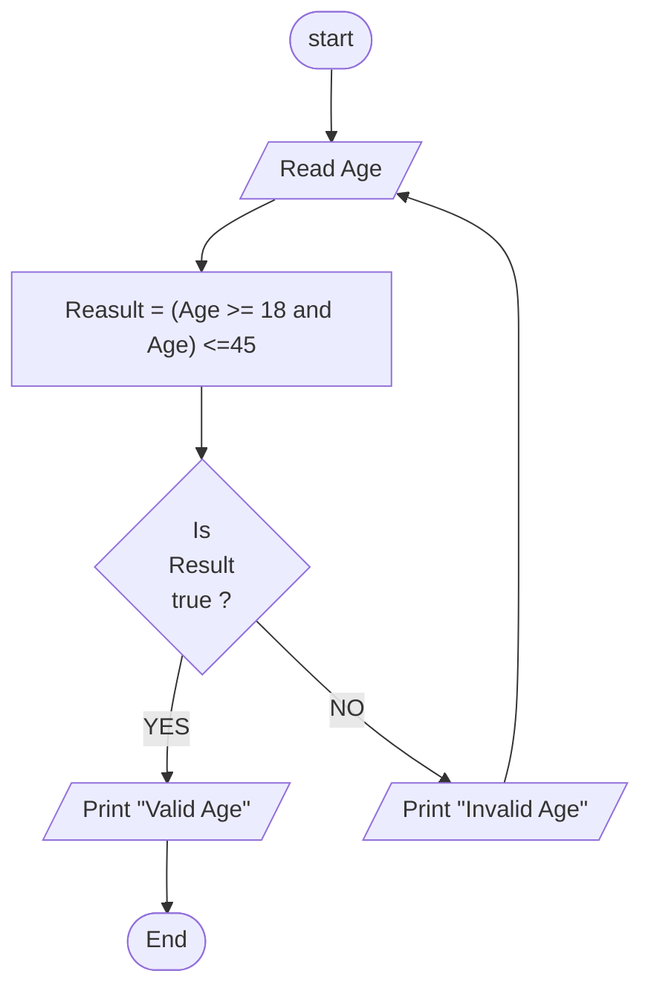

## Problem 25

>### Write a program to ask the user to enter:
> - Age  
> If age is between 18 and 45 print "Valid Age" otherwise Print "Invalid Age" and re-ask the user to enter a valid one  
>Note: You should keep asking user to enter a valid age until h/she enters a valid one
>#### Exemple Inputs:
> 17

>#### Outputs ->
> Invalid Age  
> Read Age

## Steps
**Step 1:**	Read the Age   
**Step 2:**	Result = (Age >= 18 and Age <=45)   
**Step 3:**	Check if Result = true Print "Valid Age" 
**Step 4:**	Check if Result = False Print "Invalid Age" -> Goback to Step1

### Flowchart

