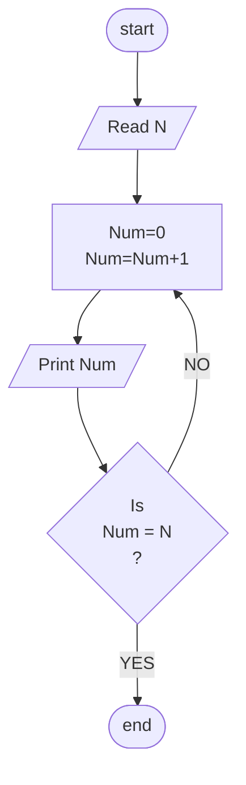

## Problem 26

>### Wirte a program to print numbers from 1 to N
> Inputs  
> - 10  
>
> Outputs ->  
>1   
>2	 
>3	 
>4	 
>5	 
>6	 
>7	 
>8	 
>9	 
>10	 
> 

### Steps

**Step 1:** Read N  
**Step 2:**	Num=0  
**Step 3:**	Num=Num +1  
**Step 4:**	Print Num  
**Step 5:**	Check if Num = N true  then end program otherwise  Num= Num+1 until = N 

### Flowchart

