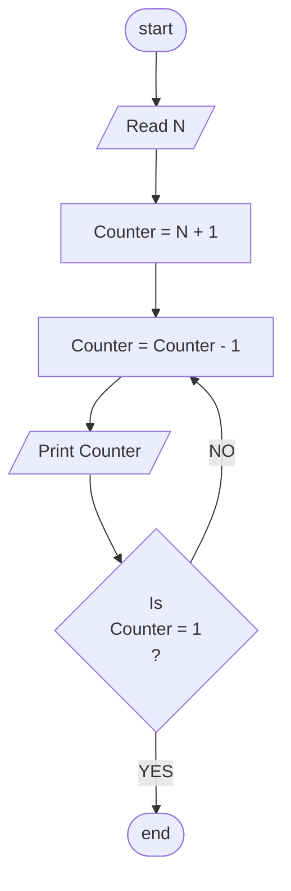

## Problem 26

>### Wirte a program to print numbers from N to 1
> Inputs  
> - 10  
>
> Outputs ->  
>10   
>9	 
>8	 
>7	 
>6	 
>5	 
>4	 
>3	 
>2	 
>1	 
> 

### Steps

**Step 1:** Read N  
**Step 2:**	Counter=N + 1 
**Step 2:**	Counter=Counter - 1  
**Step 3:**	Print Num  
**Step 4:**	Check if Counter = 0 is true then end Program otherwise  Counter= Counter-1 until it =1 

### Flowchart

