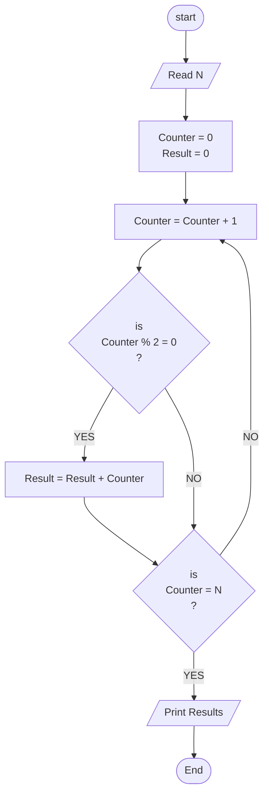

## Problem 29

>### Wirte a program to Sum Even numbers from 1 to N
> Inputs  
> 10 
>  
> Output ->  
> 25 

### Steps

**Step 1:** Read N  
**Step 2:**	Counter = 0 
**Step 3:**	Counter = Counter + 1 
**Step 4:**	Result = 0 
**Step 5:**	is Counter % 2 = 0 -> Result = Result + Counter -> is Counter = N  
**Step 6:**	Print Result If Counter = N  

### Flowchart

