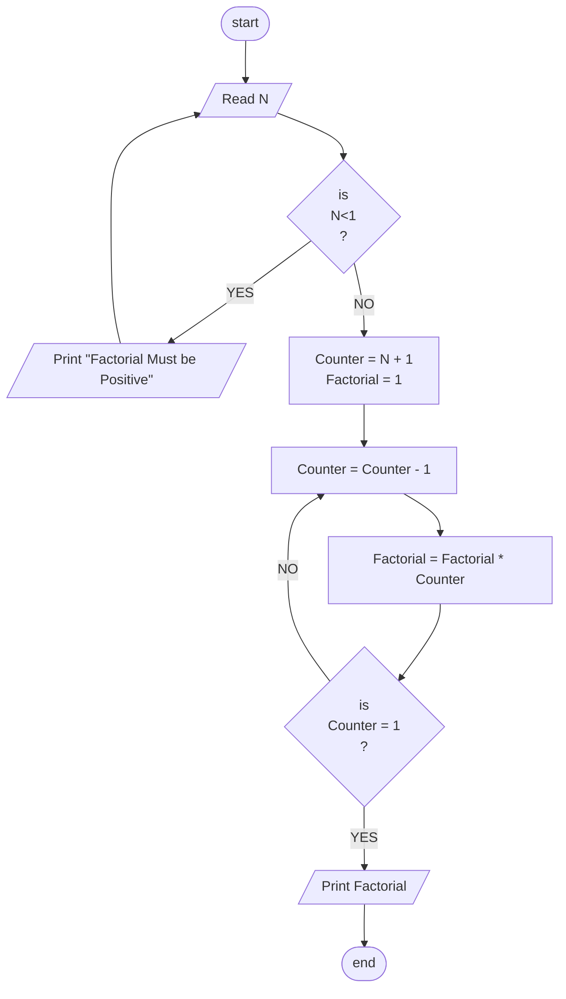

## Problem 30

>### Write a program to calculate factorial of N!
>Exemple: Factorial of 6 -> 6 x 5 x 4 x 3 x 2 x 1 =720  
>#### Note : User should enter positive number otherwise reject it and ask to enter again.
>  Input 
>  6
> 
>Outputs ->  
>720

### Flowchart

