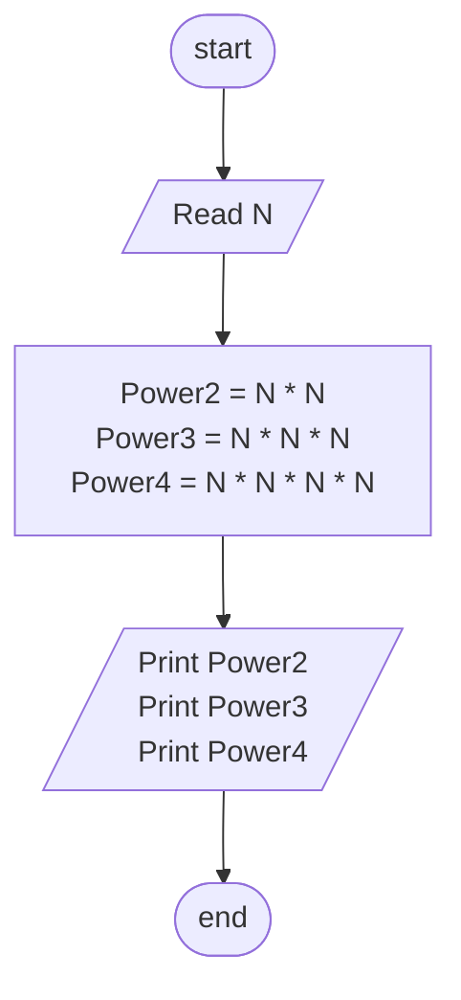

## Problem 31

>### Write a program to ask the user to enter:
> - Number
>#### then print the Number ^2,Number ^3, Number ^4
>#### Example Inputs:
>3
>#### Outputs ->
>9  
>27  
>81  

## Steps

**Step 1:**  ask the user to enter Number 
**Step 2:** Power2 = N * N 	  
**Step 3:**	Power3 = N * N * N  
**Step 4:**	Power4 = N * N * N * N  
**Step 5:**	Print Power1,Power2,Power3  

## Flowchart 

