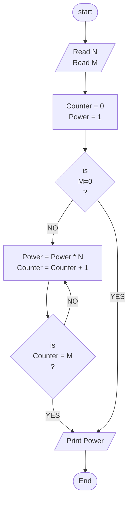

## Problem 32
>### Write a program to ask the user to enter:
> - Number
> - M
>#### Then Print the Number^M
>#### Example Inputs:
> - 2
> - 4
>#### Outputs ->
> - 16

## Steps
**Step 1:** Ask the user to enter Number and M	 
**Step 2:**	Counter = 1 
**Step 3:**	Power = 1 
**Step 4:**	Power = Power * N 
**Step 5:**	check Counter = M if yes Print Power and end Program otherwise continue  

## Flowchart 

