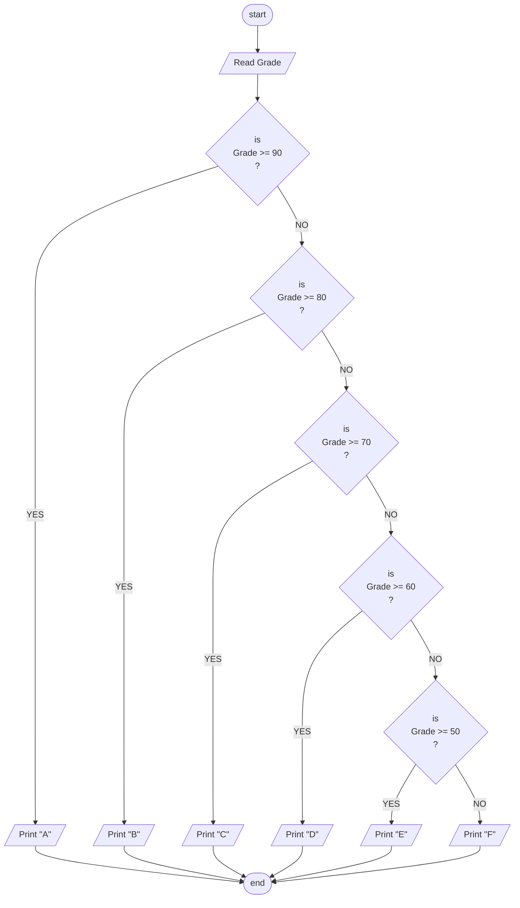

## Problem 33

>#### Write a  program to ask the user to enter: 
> - Grade   
>##### Then Print the grade as follows:  
> - 90-100 Print A  
> - 80-89  Print B 
> - 70-79  Print C 
> - 60-69  Print D 
> - 50-59  Print E 
> - Otherwise Print F 
>###### Example Inputs:
> 95  
>###### Outputs ->
> A

## Steps
**Step 1:** Ask the user to enter Grade. 
**Step 2:** Check the grade and print the Letter Grade. 

## Flowchart

