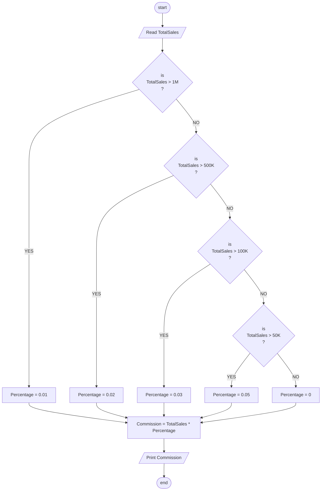

## Problem 34

>#### Write a program to ask the user to enter:
> - TotalSales
>#### The commission is calculated as  one Percentage * the total sales amount, all you need is to decide which percentage to use of the following:
> - &#62;1M -> Percentage is 1%
> - &#62;500K to 1M -> Percentage is 2% 
> - &#62;100K to 500K -> Percentage is 3% 
> - &#62;50K to 100K -> Percentage is 5% 
> -  Otherwise -> Percentage is 0% 

## Steps

**Step 1:**	Ask the user to enter TotalSales 
**Step 2:**	Check and Print the commission 

## Flowchart 

