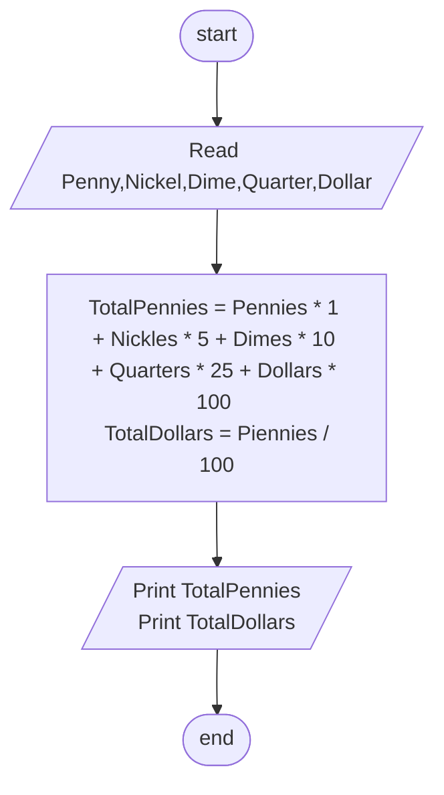

## Problem 35

>#### Write a program to ask the user ro enter:
> - Pennies,Nickels,Dimes,Quarters,Dollars
>#### Ten calculate the total pennies, total dollars and print them on screen giving that:
> - Penny = 1  
> - Nickel = 5  
> - Dime = 10  
> - Quarter = 25  
> - Dollar = 100 
>##### Example Inputs:
> 5,5,5,5,5  
>##### Outputs ->
>705 Pennies  
>7.05 Dollars

## Flowchart

