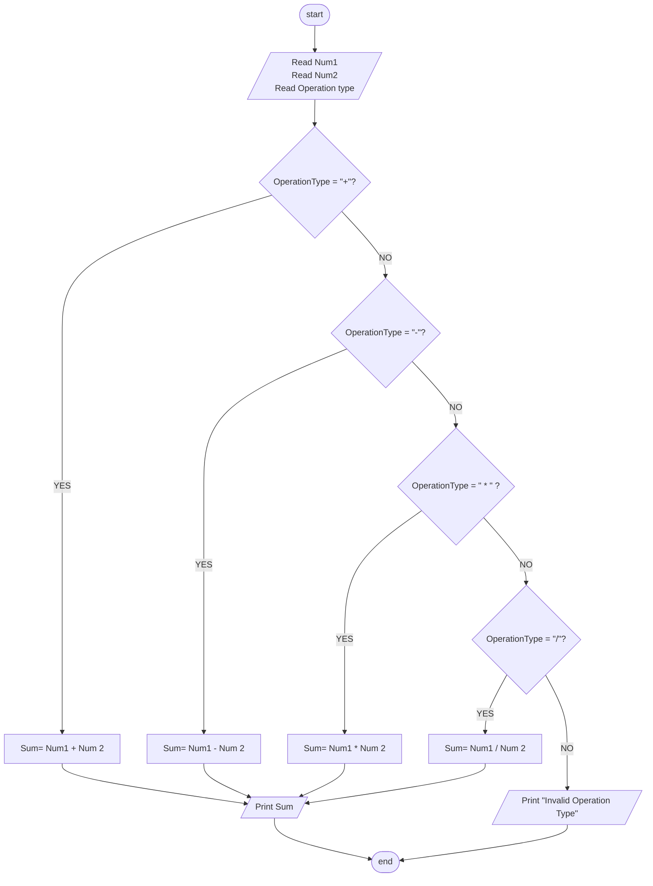

## Problem 36
>#### Write a program to ask the user to enter:
> - Number1
> - Number2
> - Operation Type
>#### Then perform the calculation according to the operation type as follows:
> "+" : add the two numbers.  
> "-" : subtract the two numbers. 
> "*" : multiply the two numbers. 
> "/" : Devide the two numbers. 

>#### Example Inputs:
> 10  
> 20  
> &#42;  
>#### Outputs ->
>200

## Flowchart 

