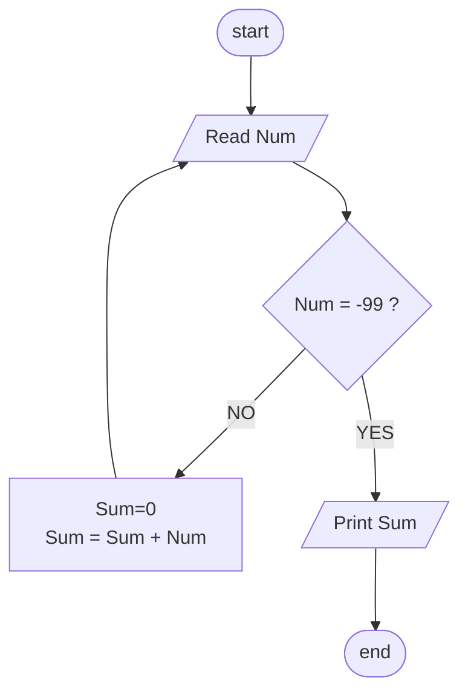

## Problem 37

>#### Write a program to read numbers from user and sum them, keep reading until the user enters -99 then print the sum on screen.
> #### Input
> - 10 
> - 20 
> - 30 
> - 40 
> - -99 
> #### Outputs ->
> 100 

## Flowcahrt 

