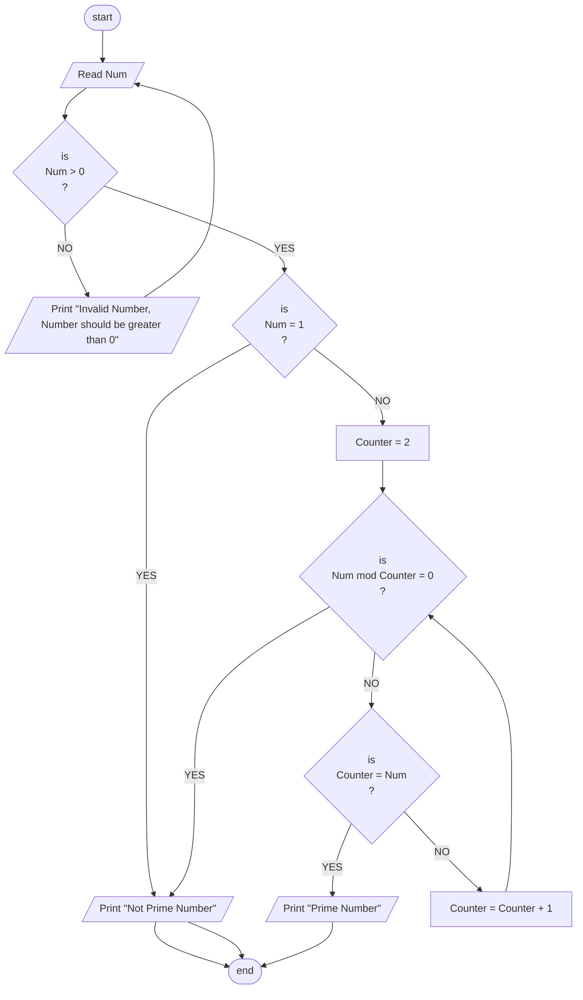

## Problem 38
>### Write a program to read number and check if it is a prime number or not.
> ##### Note: Prime number can only divide on one and on itself.
>### Input 
> 5  
> 6  
> 3  
> ### Outputs ->
> Prime  
> Not Prime  
> Prime  

## Flowchart 

