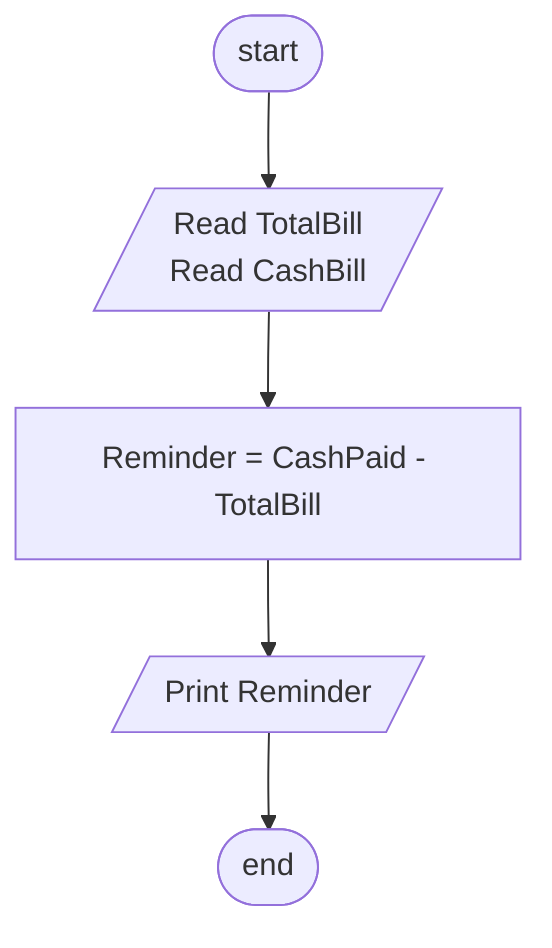

## Problem 39
>#### Write a program to read a TotalBill and CashPaid and calculate the remainder to paid back.
>##### Input
> 20  
> 50  
>##### Outputs ->
> 30

## Flowchart 

```mermaid 
flowchart TD

S([start])
E([end])
R[/Read TotalBill <br> Read CashBill/]
RTC[Reminder = CashPaid - TotalBill]
P[/Print Reminder/]

S --> R --> RTC --> P --> E

```