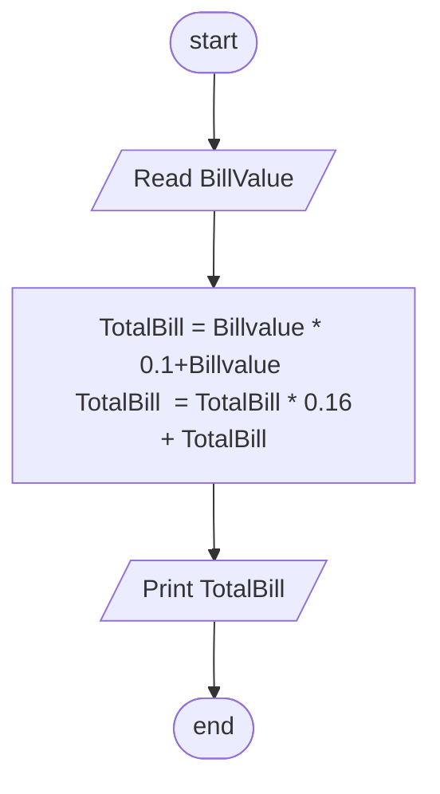

## Problem 40

>#### A restaurant charges 10% services fee and 16% sales tax.
>#### Write a program to read a BillValue and add service fee and sales tax to it, and print the TotalBill on the screen.
> ##### Input
> 100 
> ##### Outputs ->
>127.6

## Flowchart 

