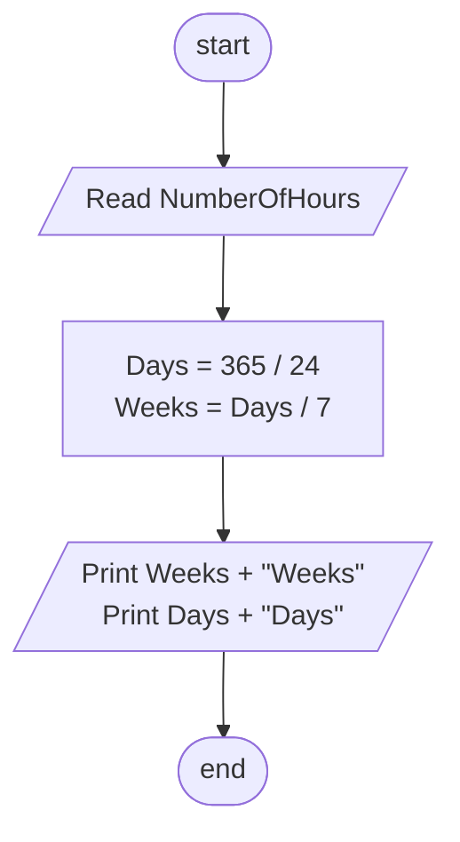

## Problem 41

>#### Write a program to rad a NumberOfHours and calculates the number of weeks, and days included in that number.
>##### Input
> 365
>##### Outputs ->
> 2.17 Weeks 
> 15.20 Days 

## Flowchart

