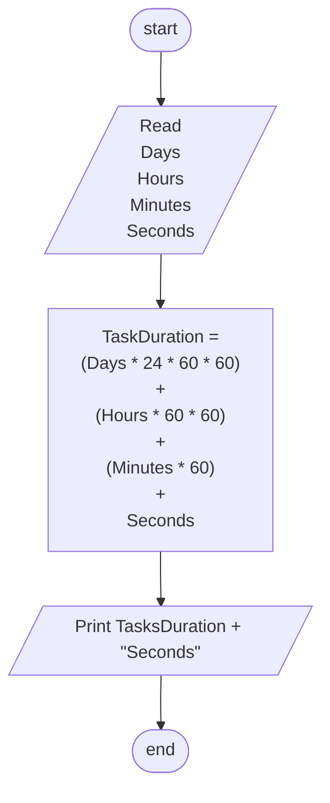

## Problem 42

>### Write a program to calculate the task duration in seconds and print it on screen
> -> Given the time duration of a task in the number of days,hours,minutes and seconds.
> #### Input 
> 2 
> 5 
> 45 
> 35 
>#### Outputs ->
> 193,535 Seconds

## Flowchart 

