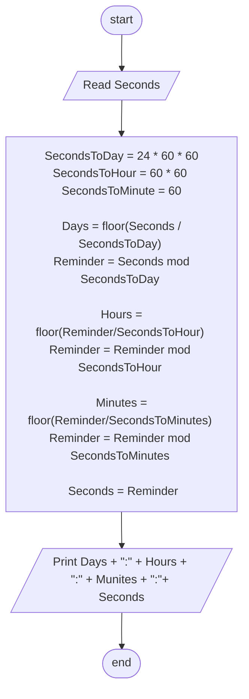

## Problem 43

>### Write a program that inputs the number of seconds and changes it to days,hours,minutes and seconds.
>#### Input
> 193,535 
> #### Outputs ->
> 2:5:45:35

## Flowchart

```mermaid
flowchart TD

S([start])
E([end])
R[/Read Seconds/]
DHMS[SecondsToDay = 24 * 60 * 60<br>SecondsToHour = 60 * 60 <br>SecondsToMinute = 60<br> <br> Days = floor#40;Seconds / SecondsToDay#41; <br> Reminder = Seconds mod SecondsToDay <br><br> Hours = floor#40;Reminder/SecondsToHour#41; Reminder = Reminder mod SecondsToHour <br> <br> Minutes = floor#40;Reminder/SecondsToMinutes#41; Reminder = Reminder mod SecondsToMinutes <br><br> Seconds = Reminder]
P[/Print Days + ":" + Hours + ":" + Munites + ":"+ Seconds/]

S --> R --> DHMS --> P --> E

```