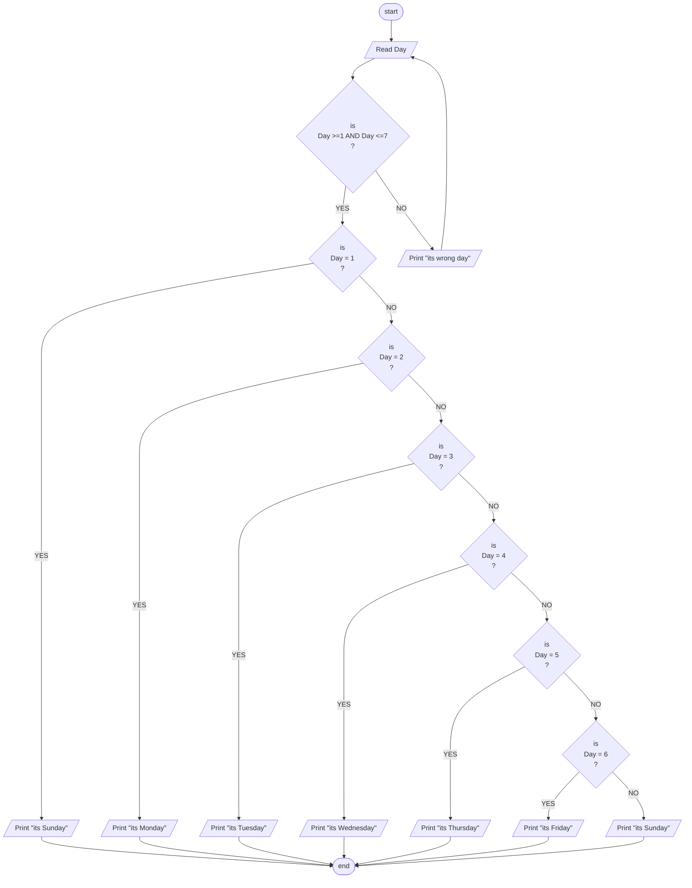

## Problem 44 

>#### Write  a program to ask the user to enter:
> - Day
>##### Then Print the day as follows:
> - 1 Print Sunday 
> - 2 Print Monday 
> - 3 Print Tuesday 
> - 4 Print Wednesday 
> - 5 Print Thursday 
> - 6 Print Friday 
> - 7 Print Saturday 
> - Otherwise print "Wrong Day" and ask the user to enter again
>##### Inputs
>6
>##### Outputs ->
> its Friday

## Flowchart
