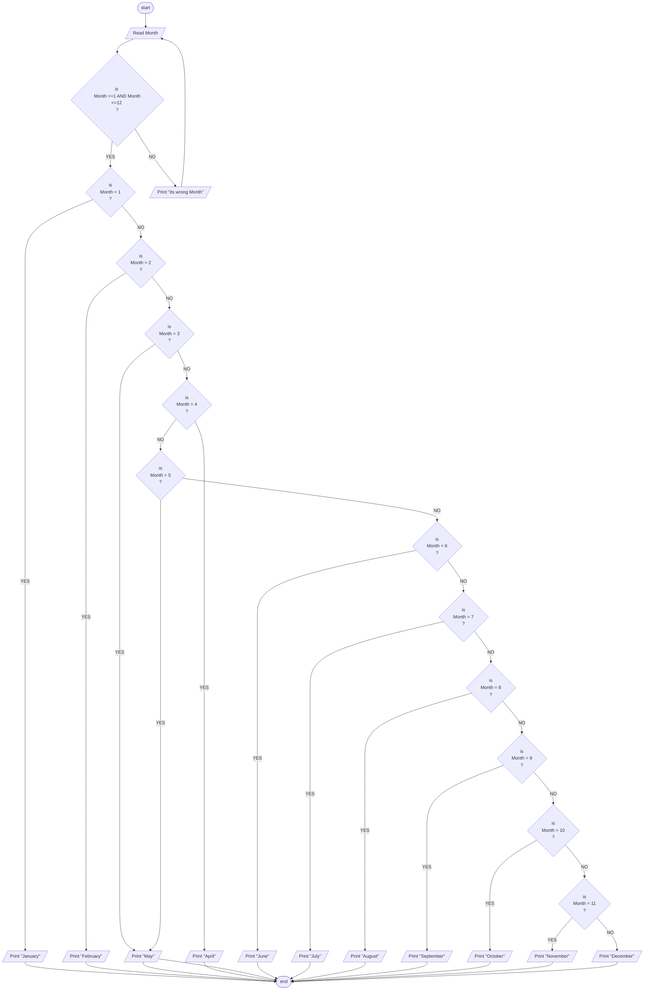

## Problem 45

>#### Write  a program to ask the user to enter:
> - Month
>##### Then Print the day as follows:
> -  1 Print January  
> -  2 Print February 
> -  3 Print March 
> -  4 Print April 
> -  5 Print May 
> -  6 Print June 
> -  7 Print July 
> -  8 Print August 
> -  9 Print September 
> - 10 Print October 
> - 11 Print November 
> - 12 Print December 
> - Otherwise print "Wrong Month" and ask the user to enter again
>##### Inputs
>11
>##### Outputs ->
> November

## Flowchart
