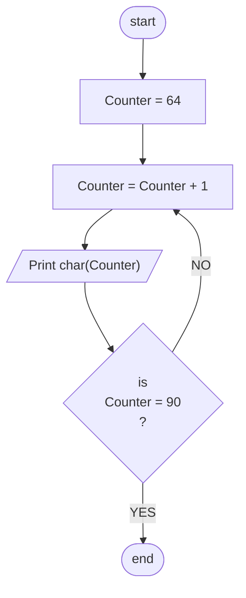

## Problem 46

>#### Write a program to print all letters from A to Z.
> ##### Outputs ->
> A 
> B 
> C 
> . 
> . 
> . 
> Z 

## Flowchart

```mermaid 
flowchart TD

S([start])
E([end])
C[Counter = 64]
C1[Counter = Counter + 1]
D{is <br> Counter = 90 <br> ?}
P[/Print char#40;Counter#41;/]

S --> C --> C1 --> P --> D 
D -- NO --> C1
D -- YES --> E

```