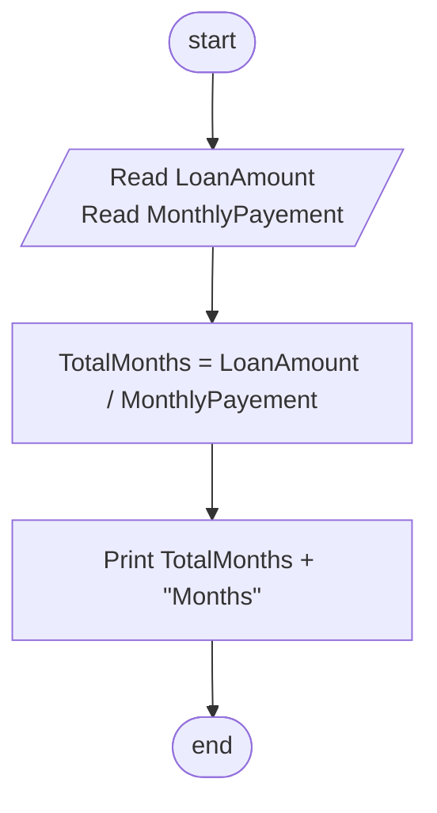

## Problem 47

>### Write a program to read a Loan Amount and Monthly Payement and calculate how many months you need to settle the loan.
> #### Input 
> 5000 
> 500 
> #### Outputs ->
> 10 Months 

## Flowchart

