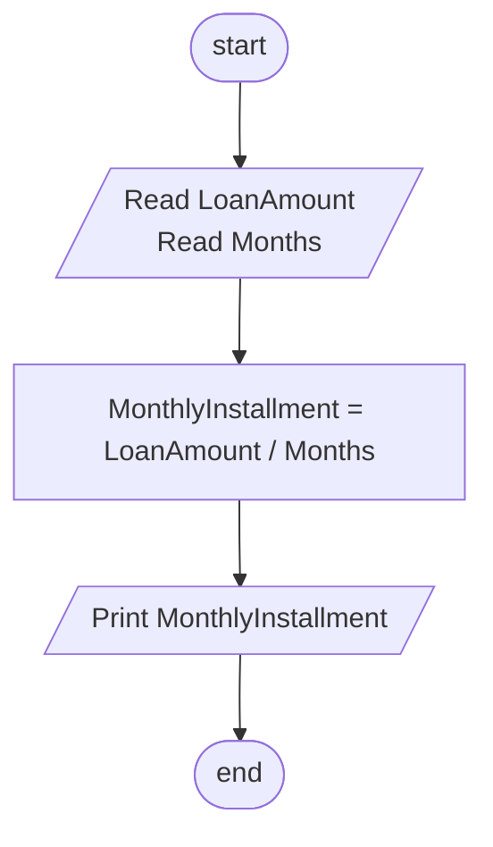

## Problem 48

>### Write a program to read a Loan Amount and ask you how many months you need to settle the loan, then calculate the monthly installment amount.
> #### Input
> 5000 
> 10 
> #### Outputs ->
> 500

## Flowchart 

