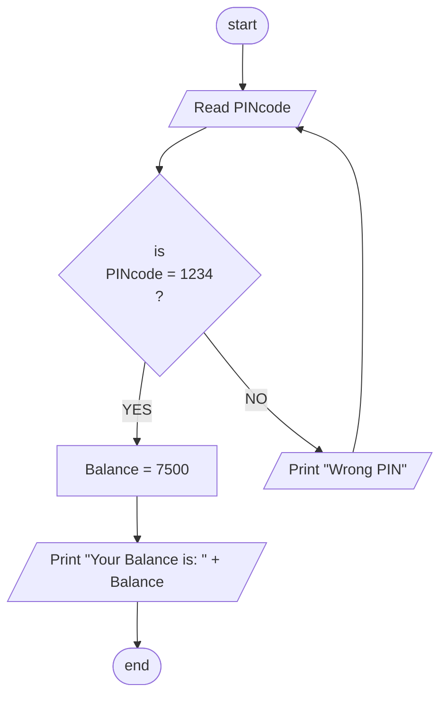

## Problem 49

>### Write a program to read the ATM PIN code from the user, then check id PIN code=1234, then show the balance user, otherwise Print "Wrong PIN" and ask the user to re-enter the PIN.
> Assume User Balance is 7500.
> #### Input
> 1234  
>  
> 5151  
> #### Outputs ->
>Your balance is: 7500  
>  
>Wrong PIN

## Flowchart

