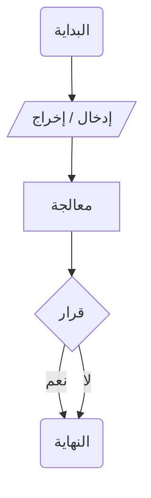
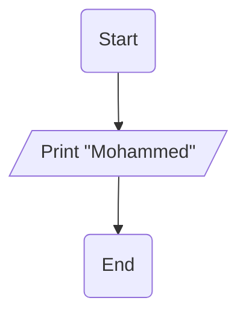
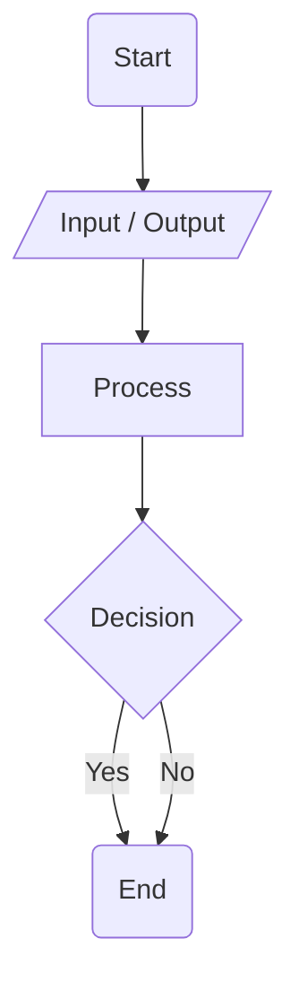

<a id="arabic"></a>
[English ↙](#english)

<div dir="rtl" style="text-align: right; font-family: 'Arial', sans-serif;">

# الخوارزميات وحل المشكلات
## الأساسيات والتفكير المنطقي

## مقدمة

الخوارزميات هي جوهر البرمجة وأساس حل المشكلات. في هذا الدرس سنتعلم كيفية تحليل المشكلات وتقسيمها إلى خطوات صغيرة يمكن للكمبيوتر فهمها وتنفيذها.

---

## ما هي الخوارزمية؟

### التعريف الأساسي 🎯

الخوارزمية هي سلسلة من الخطوات المنطقية المرتبة لحل مشكلة معينة أو أداء مهمة محددة.

</div>

<div dir="ltr" style="text-align: left; background-color: #f0f8ff; padding: 15px; border-radius: 5px; margin: 10px 0;">

```
Algorithm = Step 1 → Step 2 → Step 3 → ... → Solution
```

</div>

<div dir="rtl" style="text-align: right;">

### أمثلة من الحياة اليومية

- **طي قارب ورقي**: سلسلة خطوات محددة
- **عمل كيكة**: وصفة مرتبة بالمقادير والخطوات  
- **الذهاب لمقابلة عمل**: التخطيط والتحضير المسبق

---

## مكونات الخوارزمية

### العناصر الأساسية

</div>

<div dir="ltr" style="text-align: left; background-color: #e8f5e9; padding: 15px; border-radius: 5px; margin: 10px 0;">

```
1. المدخلات (Inputs)
2. المعالجة (Processing)
3. المخرجات (Outputs)
4. القرارات (Decisions)
5. التكرار (Repetition)
```

</div>

<div dir="rtl" style="text-align: right;">

### استراتيجية "فرق تسد"

Divide and Conquer:
- تقسيم المشكلة الكبيرة إلى مشاكل صغيرة
- حل كل مشكلة على حدة
- تجميع الحلول للوصول للحل النهائي

---

## تمثيل الخوارزميات باستخدام المخططات الانسيابية

### رموز المخططات الانسيابية الأساسية

</div>

<div dir="ltr" style="text-align: left; background-color: #fff3cd; padding: 15px; border-radius: 5px; margin: 10px 0;">
  

  
</div>

<div dir="rtl" style="text-align: right;">

### مثال عملي: طباعة الاسم



**شرح المخطط:**
- الشكل البيضاوي: بداية ونهاية البرنامج
- شكل متوازي الأضلاع: عملية الإخراج (الطباعة)
- الأسهم: اتجاه تنفيذ الخطوات

---

## تحليل المشكلات خطوة بخطوة

### مثال: برنامج بسيط لطباعة الاسم

</div>

<div dir="ltr" style="text-align: left; background-color: #d4edda; padding: 15px; border-radius: 5px; margin: 10px 0;">

```
الخطوة 1: بداية البرنامج
الخطوة 2: طباعة الاسم على الشاشة
الخطوة 3: نهاية البرنامج
```

</div>

<div dir="rtl" style="text-align: right;">

### التفكير المنطقي behind الخوارزمية

1. **الفهم**: ما المطلوب من البرنامج؟
2. **التخطيط**: ما هي الخطوات اللازمة؟
3. **التنفيذ**: تحويل الخطوات إلى كود
4. **الاختبار**: التأكد من صحة النتائج

---

## أهمية المخططات الانسيابية

### فوائد استخدام Flowcharts

</div>

<div dir="ltr" style="text-align: left; background-color: #e3f2fd; padding: 15px; border-radius: 5px; margin: 10px 0;">

```
✅ التمثيل البصري للخوارزمية
✅ تسهيل فهم تدفق البرنامج
✅ اكتشاف الأخطاء مبكراً
✅ التوثيق الواضح للعمليات
✅ التواصل الفعال مع المطورين
```

</div>

<div dir="rtl" style="text-align: right;">

### كيفية بناء مخطط انسيابي فعال

1. تحديد البداية والنهاية
2. تحديد المدخلات والمخرجات
3. تحديد العمليات الحسابية
4. تحديد نقاط اتخاذ القرار
5. تحديد التكرارات والحلقات

---

## الخلاصة

### النقاط الأساسية:

</div>

<div dir="ltr" style="text-align: left; background-color: #f5f5f5; padding: 15px; border-radius: 5px; margin: 10px 0;">

```
🎯 الخوارزمية: سلسلة خطوات لحل مشكلة
📊 المخطط الانسيابي: تمثيل بصري للخوارزمية
🔍 تحليل المشكلة: تقسيمها لأجزاء صغيرة
🚀 التفكير المنطقي: أساس البرمجة الناجحة
💡 التخطيط قبل التنفيذ: مفتاح النجاح
```

</div>

<div dir="rtl" style="text-align: right;">

### القاعدة الذهبية:
> **"التفكير الجيد في الخوارزمية يوفر 90% من مجهود البرمجة، والتنفيذ لا يأخذ سوى 10%"**

</div>

<br><br><br><br><br><br><br><br><br>

<a id="english"></a>
[العربية ↗](#arabic)

# Algorithms and Problem Solving
## Fundamentals and Logical Thinking

## Introduction

Algorithms are the essence of programming and the foundation of problem solving. In this lesson, we will learn how to analyze problems and break them down into small steps that computers can understand and execute.

---

## What is an Algorithm?

### Basic Definition 🎯

An algorithm is a sequence of logical, ordered steps to solve a specific problem or perform a particular task.

</div>

<div dir="ltr" style="text-align: left; background-color: #f0f8ff; padding: 15px; border-radius: 5px; margin: 10px 0;">

```
Algorithm = Step 1 → Step 2 → Step 3 → ... → Solution
```

</div>

<div dir="rtl" style="text-align: right;">

### Examples from Daily Life

- **Folding a paper boat**: Specific sequence of steps
- **Baking a cake**: Ordered recipe with ingredients and steps
- **Going to job interview**: Prior planning and preparation

---

## Algorithm Components

### Basic Elements

</div>

<div dir="ltr" style="text-align: left; background-color: #e8f5e9; padding: 15px; border-radius: 5px; margin: 10px 0;">

```
1. Inputs
2. Processing
3. Outputs
4. Decisions
5. Repetition
```

</div>

<div dir="rtl" style="text-align: right;">

### "Divide and Conquer" Strategy

Divide and Conquer:
- Breaking large problems into small ones
- Solving each problem separately
- Combining solutions to reach final solution

---

## Representing Algorithms with Flowcharts

### Basic Flowchart Symbols

</div>

<div dir="ltr" style="text-align: left; background-color: #fff3cd; padding: 15px; border-radius: 5px; margin: 10px 0;">



</div>

<div dir="rtl" style="text-align: right;">

### Practical Example: Printing Name


**Chart Explanation:**
- Oval shape: Program start and end
- Parallelogram: Output process
- Arrows: Execution direction

---

## Step-by-Step Problem Analysis

### Example: Simple Name Printing Program

</div>

<div dir="ltr" style="text-align: left; background-color: #d4edda; padding: 15px; border-radius: 5px; margin: 10px 0;">

```
Step 1: Program start
Step 2: Print name on screen
Step 3: Program end
```

</div>

<div dir="rtl" style="text-align: right;">

### Logical Thinking Behind Algorithm

1. **Understanding**: What does the program need to do?
2. **Planning**: What steps are needed?
3. **Implementation**: Converting steps to code
4. **Testing**: Verifying results correctness

---

## Importance of Flowcharts

### Benefits of Using Flowcharts

</div>

<div dir="ltr" style="text-align: left; background-color: #e3f2fd; padding: 15px; border-radius: 5px; margin: 10px 0;">

```
✅ Visual algorithm representation
✅ Easy understanding of program flow
✅ Early error detection
✅ Clear process documentation
✅ Effective communication with developers
```

</div>

<div dir="rtl" style="text-align: right;">

### How to Build Effective Flowchart

1. Identify start and end points
2. Identify inputs and outputs
3. Identify arithmetic operations
4. Identify decision points
5. Identify repetitions and loops

---

## Summary

### Key Points:

</div>

<div dir="ltr" style="text-align: left; background-color: #f5f5f5; padding: 15px; border-radius: 5px; margin: 10px 0;">

```
🎯 Algorithm: Step sequence to solve problem
📊 Flowchart: Visual algorithm representation
🔍 Problem analysis: Breaking into small parts
🚀 Logical thinking: Foundation of successful programming
💡 Planning before implementation: Key to success
```

</div>

<div dir="rtl" style="text-align: right;">

### Golden Rule:
> **"Good algorithm thinking saves 90% of programming effort, while implementation takes only 10%"**

</div>

---
*Anas Chetoui* - `@anaschetoui`