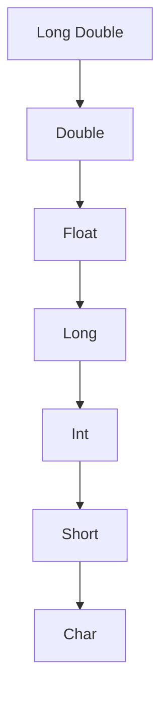

<div dir="rtl">

<a id="arabic-conversion"></a>
    
[English ↙](#english-conversion)

# 🔄 تحويل أنواع البيانات | Data Type Conversion

## 🎯 المقدمة
تحويل أنواع البيانات (Data Type Conversion) أو ما يسمى بالـ "Casting" هو عملية تحويل بيانات من نوع إلى نوع آخر. هذه العملية أساسية في البرمجة وتستخدم بكثرة في التطبيقات والبرمجيات.

## 💡 المفاهيم الأساسية

### أنواع التحويل
1. **التحويل الضمني (Implicit Conversion):** التحويل يتم تلقائياً بواسطة المترجم.
2. **التحويل الصريح (Explicit Conversion):** التحويل يتم يدوياً بواسطة المبرمج.

### تسلسل أنواع البيانات من الأكبر إلى الأصغر
<div dir="ltr" align="left">



</div>

### فقدان البيانات (Data Loss)
- التحويل من نوع كبير إلى صغير يؤدي إلى فقدان المعلومات.
- التحويل من نوع صغير إلى كبير لا يؤثر على البيانات.

## 🛠️ أمثلة عملية

### 📝 التحويل بين الأنواع الرقمية
<div dir="ltr" align="left">

```cpp
#include <iostream>
using namespace std;

int main() {
    double num2 = 18.99;
    int num1;
    // التحويل الضمني
    num1 = num2;
    cout << "Implicit conversion: " << num1 << endl;  // 18
    // التحويل الصريح (C-Style)
    num1 = (int)num2;
    cout << "Explicit conversion (C-Style): " << num1 << endl;  // 18
    // التحويل بدالة
    num1 = int(num2);
    cout << "Explicit conversion (Function): " << num1 << endl;  // 18
    return 0;
}
```
</div>

### 📝 التحويل من String إلى أنواع رقمية
<div dir="ltr" align="left">

```cpp
#include <iostream>
#include <string>
using namespace std;

int main() {
    string str = "123.456";
    int numInt = stoi(str);
    cout << "String to Integer: " << numInt << endl;  // 123
    float numFloat = stof(str);
    cout << "String to Float: " << numFloat << endl;  // 123.456
    double numDouble = stod(str);
    cout << "String to Double: " << numDouble << endl;  // 123.456
    return 0;
}
```
</div>

### 📝 التحويل من أنواع رقمية إلى String
<div dir="ltr" align="left">

```cpp
#include <iostream>
#include <string>
using namespace std;

int main() {
    int num1 = 123;
    double num2 = 18.99;
    string str1 = to_string(num1);
    cout << "Integer to String: " << str1 << endl;  // "123"
    string str2 = to_string(num2);
    cout << "Double to String: " << str2 << endl;  // "18.990000"
    return 0;
}
```
</div>

## ❌ الأخطاء الشائعة

### 1. الاعتماد على التحويل الضمني
<div dir="ltr" align="left">

```cpp
// ❌ قد يعطي نتائج غير متوقعة
    double num = 13.6;
    int result = num;   // قد يعطي 13 أو 14
// ✅ استخدم التحويل الصريح
    double num = 13.6;
    int result = (int)num;  // دائماً يعطي 13
```
</div>

### 2. إجراء عمليات حسابية على String
<div dir="ltr" align="left">

```cpp
// ❌ لا يمكن إجراء عمليات حسابية مباشرة على String
    string str = "123";
    int result = str + 5;   // خطأ!
// ✅ التحويل أولاً ثم العملية
    string str = "123";
    int num = stoi(str);
    int result = num + 5;   // 128
```
</div>

## 🏆 أفضل الممارسات
- استخدم التحويل الصريح.
- استخدم الدوال المخصصة للتحويل.
- تحقق دائماً من فقدان البيانات.

## 📊 دوال التحويل الأساسية
- `stoi()` لتحويل String إلى Int
- `stof()` لتحويل String إلى Float
- `stod()` لتحويل String إلى Double
- `to_string()` لتحويل الأنواع الرقمية إلى String

## 📝 الملخص
- التحويل الضمني أوتوماتيكي، التحويل الصريح يدوي.
- فقدان البيانات يحدث عند التحويل من نوع كبير إلى صغير.
- استخدم الدوال ويفضل التحويل الصريح دائماً.

<br>
<br>
<br>
<br>
<br>
<br>
<br>
<br>
<br>
<br>
</div>
<a id="english-conversion"></a>
    
[العربية ↗](#arabic-conversion)

# 🔄 Data Type Conversion

## 🎯 Introduction
Data Type Conversion (also called "Casting") means changing data from one type to another. This is a basic and important operation in programming and appears in many applications.

## 💡 Core Concepts

### Types of Conversion
1. **Implicit Conversion:** The compiler does it automatically.
2. **Explicit Conversion:** The programmer does it manually.

### Data Type Hierarchy from Larger to Smaller
```text
                   Higher Data Type
     ↑
No Data Loss
     │
+------------------+
|   Long Double    |
+------------------+
         │
+------------------+
|     Double       |
+------------------+
         │
+------------------+
|      Float       |
+------------------+
         │
+------------------+
|      Long        |
+------------------+
         │
+------------------+
|      Int         |
+------------------+
         │
+------------------+
|     Short        |
+------------------+
         │
+------------------+
|      Char        |
+------------------+
     │
     ↓
Data Loss
          Lower Data Type
```

### Data Loss
- Converting from a larger type to a smaller type (for example: Double to Int) causes data loss.
- Converting from smaller to larger type does not result in data loss.

## 🛠️ Practical Examples

### 📝 Conversion Between Numeric Types
```cpp
#include <iostream>
using namespace std;

int main() {
    double num2 = 18.99;
    int num1;
    // Implicit conversion
    num1 = num2;
    cout << "Implicit conversion: " << num1 << endl;  // 18
    // Explicit conversion (C-Style)
    num1 = (int)num2;
    cout << "Explicit conversion (C-Style): " << num1 << endl;  // 18
    // Explicit conversion (Function)
    num1 = int(num2);
    cout << "Explicit conversion (Function): " << num1 << endl;  // 18
    return 0;
}
```

### 📝 Conversion from String to Numeric Types
```cpp
#include <iostream>
#include <string>
using namespace std;

int main() {
    string str = "123.456";
    int numInt = stoi(str);
    cout << "String to Integer: " << numInt << endl;  // 123
    float numFloat = stof(str);
    cout << "String to Float: " << numFloat << endl;  // 123.456
    double numDouble = stod(str);
    cout << "String to Double: " << numDouble << endl;  // 123.456
    return 0;
}
```

### 📝 Conversion from Numeric Types to String
```cpp
#include <iostream>
#include <string>
using namespace std;

int main() {
    int num1 = 123;
    double num2 = 18.99;
    string str1 = to_string(num1);
    cout << "Integer to String: " << str1 << endl;  // "123"
    string str2 = to_string(num2);
    cout << "Double to String: " << str2 << endl;  // "18.990000"
    return 0;
}
```

## ❌ Common Errors

### 1. Relying on Implicit Conversion
```cpp
// ❌ May give unexpected results
    double num = 13.6;
    int result = num;   // Might give 13 or 14
// ✅ Use explicit conversion
    double num = 13.6;
    int result = (int)num;  // Always gives 13
```

### 2. Doing Arithmetic with String
```cpp
// ❌ Cannot do arithmetic directly on a string
    string str = "123";
    int result = str + 5;   // Error!
// ✅ Convert first, then perform arithmetic
    string str = "123";
    int num = stoi(str);
    int result = num + 5;   // 128
```

## 🏆 Best Practices
- Use explicit conversion.
- Use specialized conversion functions.
- Always check for data loss when converting from larger to smaller types.

## 📊 Main Conversion Functions
- `stoi()` for String to Int
- `stof()` for String to Float
- `stod()` for String to Double
- `to_string()` for Numeric to String

## 📝 Summary
- Implicit conversion is automatic, explicit is manual.
- Data loss occurs when converting from larger to smaller types.
- Always use conversion functions, and prefer explicit conversion.

<br>
<br>
<br>
<br>
<br>
<br>
<br>
<br>
<br>

---

*Anas Chetoui* - `@anaschetoui`