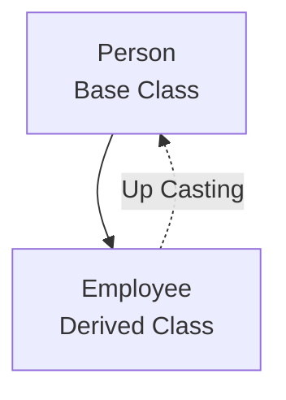
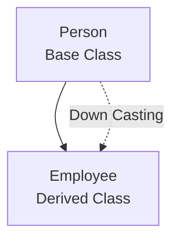
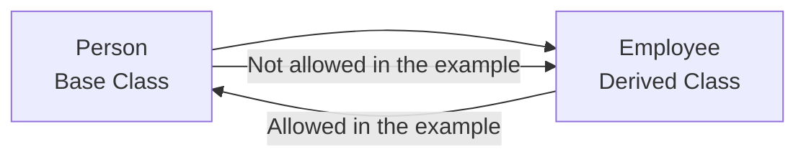



[English ↙](#english)

# Up Casting vs Down Casting

---

## 📝 مقدمة

في `Inheritance` يمكن أن نستخدم `Casting` بين `Base Class` و`Derived Class`.

في هذا الدرس نركّز على نوعين:

- `Up Casting`
- `Down Casting`

الفكرة مرتبطة بالاتجاه بين الـ `Base Class` والـ `Derived Class`، وتظهر بوضوح عند استخدام `Pointers`.

---

## 🧠 مراجعة سريعة

لدينا العلاقة:

`Person → Employee`

حيث:

- `Person` هي الـ `Base Class`.
- `Employee` هي الـ `Derived Class`.

لأن `Employee` ترث من `Person`، فإن `Employee` تحتوي على الجزء الموروث من `Person` بالإضافة إلى أعضائها الخاصة.

---

## 🎯 تعريف: Up Casting

graph TD
    Person["Person Base Class"] --> Employee["Employee Derived Class"]
    Employee -. "Up Casting" .-> Person

> **Up Casting**
>
> تحويل أو إسناد `Derived Class` إلى نوع `Base Class` باستخدام `Pointer`.

إذا كانت لدينا `Employee`، فيمكن لـ `Person Pointer` أن يشير إلى عنوان `Employee`.

السبب هو أن `Employee` تحتوي أصلًا على الجزء الموروث من `Person`.

---

## ⚙️ كيف يعمل Up Casting؟

لدينا `Employee1` من نوع `Employee`.

يمكن جعل `Person Pointer` يشير إلى عنوان `Employee1`.

يصبح نوع الـ `Pointer` هو `Person`، لكنه يشير فعليًا إلى `Employee`.

من خلال هذا الـ `Pointer` يمكن الوصول إلى الأعضاء التي يعرفها `Person`.

لذلك يمكن الوصول إلى:

`FullName()`

لكن لا يمكن الوصول إلى:

`Title`

لأن `Title` عضو خاص بـ `Employee` وليس عضوًا في `Person`.

---

## 📌 لماذا يمكن استخدام Up Casting؟

`Employee` ترث من `Person`.

لذلك كل `Employee` تحتوي على الجزء الموجود في `Person`.

عندما نجعل `Person Pointer` يشير إلى `Employee`، فنحن نستخدم الجزء الذي نضمن وجوده داخل `Employee`.

لذلك:

`Employee → Person`

يمكن استخدامها كـ `Up Casting`.

---

## 🎯 تعريف: Down Casting

graph TD
    Person["Person Base Class"] --> Employee["Employee Derived Class"]
    Person -. "Down Casting" .-> Employee

> **Down Casting**
>
> تحويل `Base Class` إلى `Derived Class`.

في المثال المستخدم في الدرس، لا يمكن تنفيذ هذا التحويل.

---

## ⚙️ لماذا لا يعمل Down Casting؟

إذا كان لدينا `Person` فقط، فلا يوجد ضمان أن هذا الكائن هو `Employee`.

`Employee` لديها أعضاء إضافية مثل:

`Title`

بينما `Person` لا تحتوي على `Title`.

لذلك لا يمكن أخذ `Person` وتحويلها مباشرة إلى `Employee`، لأننا لا نضمن وجود الأعضاء الإضافية الخاصة بـ `Employee`.

أي:

`Person` لا تضمن أنها `Employee`.

---

## 📌 Up Casting مقابل Down Casting

graph LR
    Person["Person Base Class"] --> Employee["Employee Derived Class"]
    Employee -->|Allowed in the example| Person
    Person -->|Not allowed in the example| Employee

في `Up Casting`:

`Employee → Person`

يمكن لـ `Person Pointer` أن يشير إلى `Employee Object`.

في `Down Casting`:

`Person → Employee`

لا يمكن القيام بذلك في المثال.

---

## 📌 ماذا يمكن الوصول إليه بعد Up Casting؟

عندما يشير `Person Pointer` إلى `Employee Object`، يمكن الوصول إلى أعضاء `Person` التي يعرفها الـ `Pointer`.

لكن الأعضاء الخاصة بـ `Employee` مثل:

`Title`

لا تكون متاحة من خلال `Person Pointer`.

---

## 📚 المصطلحات

| المصطلح | المعنى |
|---|---|
| Casting | تحويل النوع |
| Up Casting | تحويل `Derived Class` إلى `Base Class` |
| Down Casting | تحويل `Base Class` إلى `Derived Class` |
| Base Class | الكلاس الأصلية |
| Derived Class | الكلاس الوارثة |
| Pointer | مؤشر يخزن عنوان كائن |

---

## ⚠️ ملاحظات

- `Person` هي `Base Class`.
- `Employee` هي `Derived Class`.
- `Up Casting` يجعل `Base Class Pointer` يشير إلى `Derived Class Object`.
- بعد `Up Casting` نستخدم الأعضاء التي يعرفها `Person`.
- `Title` لا يمكن الوصول إليه من خلال `Person Pointer`.
- `Down Casting` من `Person` إلى `Employee` غير مسموح به في المثال.

---

## 💡 الفكرة الأساسية

احفظ العلاقة أولًا:

`Person → Employee`

ثم:

`Employee → Person`

هذا هو `Up Casting` في المثال.

أما:

`Person → Employee`

فهذا هو `Down Casting`، وهو غير مسموح به في المثال.

---

## 🔑 ملخص

- `Up Casting` هو تحويل `Derived Class` إلى `Base Class`.
- يمكن لـ `Person Pointer` أن يشير إلى `Employee Object`.
- بعد `Up Casting` نستخدم الأعضاء التي يعرفها `Person`.
- `Title` لا يظهر من خلال `Person Pointer`.
- `Down Casting` هو تحويل `Base Class` إلى `Derived Class`.
- `Down Casting` غير مسموح به في المثال.

 
 
 
 
 
 
 
 
 
 
 
 
 
 
 
 

[العربية ↗](#arabic)

## 📝 Introduction

In `Inheritance`, we can use `Casting` between a `Base Class` and a `Derived Class`.

This lesson focuses on:

- `Up Casting`
- `Down Casting`

The idea is about the direction between the `Base Class` and the `Derived Class`, especially when using `Pointers`.

---

## 🧠 Quick Recap

We have this relationship:

`Person → Employee`

where:

- `Person` is the `Base Class`.
- `Employee` is the `Derived Class`.

Because `Employee` inherits from `Person`, an `Employee` contains the inherited `Person` part plus its own members.

---

## 🎯 Definition: Up Casting

> **Up Casting**
>
> Converting or assigning a `Derived Class` to a `Base Class` type using a `Pointer`.

If we have an `Employee`, a `Person Pointer` can point to its address.

The pointer type is `Person`, but it points to an `Employee`.

---

## ⚙️ How Does Up Casting Work?

We have `Employee1` of type `Employee`.

A `Person Pointer` can point to the address of `Employee1`.

The pointer type becomes `Person`, but it points to an `Employee`.

Through this pointer, we can access members known by `Person`.

So we can access:

`FullName()`

But we cannot access:

`Title`

because `Title` belongs to `Employee`, not to `Person`.

---

## 📌 Why Is Up Casting Allowed?

`Employee` inherits from `Person`.

So every `Employee` contains the part that exists in `Person`.

When a `Person Pointer` points to an `Employee`, it uses the part that is guaranteed to exist inside the `Employee`.

So:

`Employee → Person`

is `Up Casting`.

---

## 🎯 Definition: Down Casting

> **Down Casting**
>
> Converting a `Base Class` to a `Derived Class`.

In the example used in the lesson, this conversion cannot be done.

---

## ⚙️ Why Does Down Casting Not Work?

If we only have a `Person`, there is no guarantee that this object is an `Employee`.

`Employee` has extra members such as:

`Title`

But `Person` does not have `Title`.

So we cannot take a `Person` and directly turn it into an `Employee`, because we cannot guarantee that the extra `Employee` members exist.

In other words:

`Person` is not guaranteed to be an `Employee`.

---

## 📌 Up Casting vs Down Casting

With `Up Casting`:

`Employee → Person`

A `Person Pointer` can point to an `Employee Object`.

With `Down Casting`:

`Person → Employee`

This is not allowed in the example.

---

## 📌 What Can We Access After Up Casting?

When a `Person Pointer` points to an `Employee Object`, we can access the members known by `Person`.

But extra `Employee` members such as:

`Title`

are not available through the `Person Pointer`.

---

## 📚 Terminology

| Term | Meaning |
|---|---|
| Casting | Changing a type |
| Up Casting | Converting a `Derived Class` to a `Base Class` |
| Down Casting | Converting a `Base Class` to a `Derived Class` |
| Base Class | The original class |
| Derived Class | The class that inherits |
| Pointer | A pointer that stores an object address |

---

## ⚠️ Notes

- `Person` is the `Base Class`.
- `Employee` is the `Derived Class`.
- `Up Casting` lets a `Base Class Pointer` point to a `Derived Class Object`.
- After `Up Casting`, we use members known by `Person`.
- `Title` cannot be accessed through a `Person Pointer`.
- `Down Casting` from `Person` to `Employee` is not allowed in the example.

---

## 💡 Key Idea

First remember the relationship:

`Person → Employee`

Then:

`Employee → Person`

This is `Up Casting` in the example.

But:

`Person → Employee`

is `Down Casting`, and it is not allowed in the example.

---

## 🔑 Summary

- `Up Casting` means converting a `Derived Class` to a `Base Class`.
- A `Person Pointer` can point to an `Employee Object`.
- After `Up Casting`, we use members known by `Person`.
- `Title` is not available through a `Person Pointer`.
- `Down Casting` means converting a `Base Class` to a `Derived Class`.
- `Down Casting` is not allowed in the example.

---

*Anas Chetoui* - `@anaschetoui`
