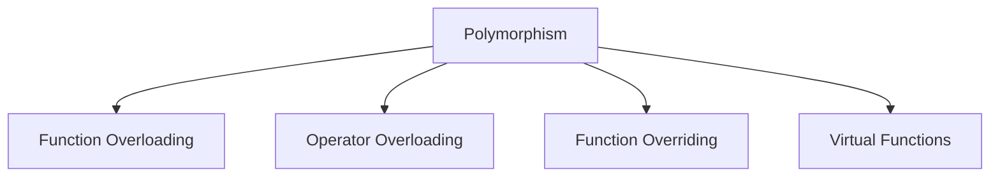
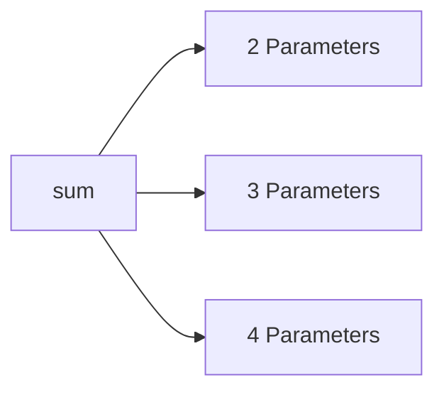
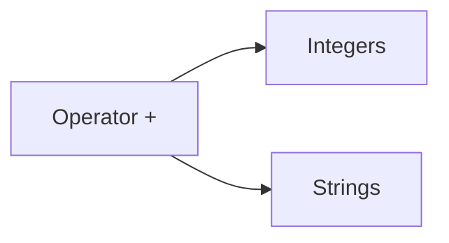
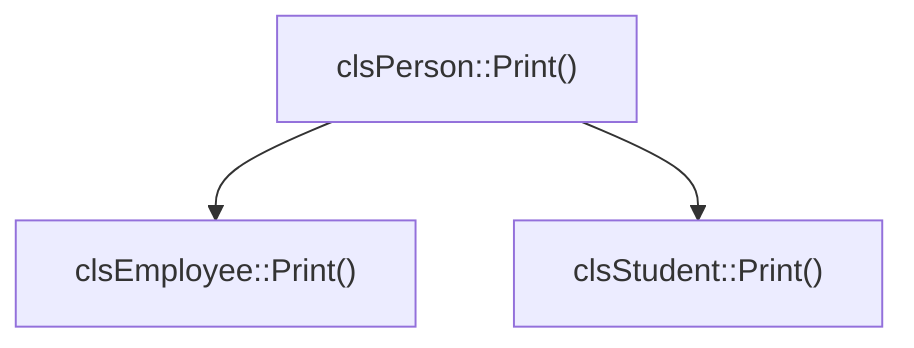
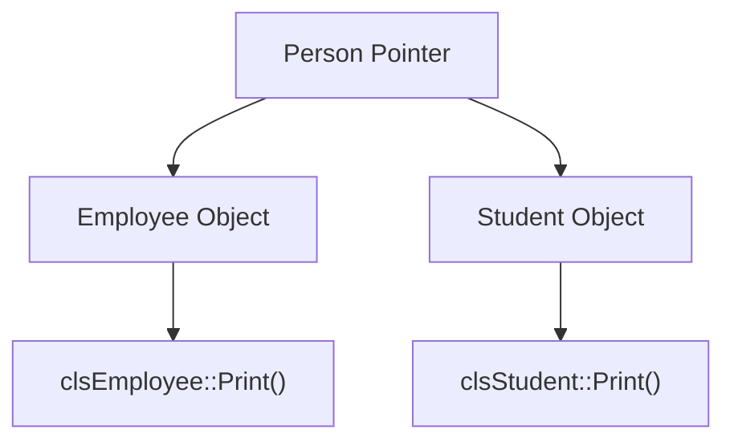



[English ↙](#english)

# Fourth Principle/Concept of OOP: Polymorphism

---

## 📝 مقدمة

`Polymorphism` هو المبدأ الرابع من مبادئ OOP.

معنى الكلمة هو **تعدد الأشكال**.

الفكرة هي أن يكون لدينا اسم أو واجهة واحدة، ولكن يمكن أن يكون لها سلوك مختلف حسب الحالة التي يتم استخدامها فيها.

---

## 🧠 مراجعة سريعة

استخدمنا سابقًا عدة مفاهيم مرتبطة بـ `Polymorphism`، مثل:

- `Function Overloading`
- `Operator Overloading`
- `Function Overriding`
- `Virtual Functions`

في كل حالة، يوجد شكل واحد للتعامل مع الكود، لكن السلوك يمكن أن يختلف حسب الموقف.

---

## 🎯 تعريف: Polymorphism

> **Polymorphism**
>
> مبدأ يعني تعدد الأشكال، بحيث يمكن استخدام الاسم أو الواجهة نفسها لتنفيذ سلوك مختلف حسب الحالة الموجودة.

يمكن التفكير فيه كالتالي:

graph TD
    P["Polymorphism"] --> F["Function Overloading"]
    P --> O["Operator Overloading"]
    P --> R["Function Overriding"]
    P --> V["Virtual Functions"]

---

## 🎯 تعريف: Function Overloading

graph LR
    S["sum"] --> A["2Parameters"]
    S --> B["3Parameters"]
    S --> C["4Parameters"]

> **Function Overloading**
>
> تعريف أكثر من دالة بالاسم نفسه، مع اختلاف عدد الـ `Parameters` أو أنواعها.

في المثال الذي تم شرحه، لدينا دالة باسم `sum`.

يمكن أن تستقبل عددًا مختلفًا من الـ `Parameters`.

إذا استقبلت ` 2Parameters ` تنفذ الجمع المناسب لهما، وإذا استقبلت ` 3Parameters` تتعامل مع الثلاثة.

الاسم يبقى:

`sum`

لكن طريقة استخدامها تختلف حسب عدد أو نوع الـ `Parameters`.

---

## 📌 لماذا تعد Function Overloading نوعًا من Polymorphism؟

بدل إنشاء أسماء مختلفة لكل حالة، نحافظ على اسم واحد:

`sum`

ونستخدمه مع حالات مختلفة.

هذا يجعل التعامل مع الكود أكثر اتساقًا، ويمنع الحاجة إلى أسماء كثيرة لدوال تقوم بالفكرة نفسها.

---

## 🎯 تعريف: Operator Overloading

graph LR
    A["Operator +"] --> I["Integers"]
    A --> S["Strings"]

> **Operator Overloading**
>
> إعطاء الـ `Operator` نفسه سلوكًا مناسبًا حسب أنواع القيم التي يتم استخدامه معها.

من الأمثلة التي تم ذكرها:

`+`

مع الأعداد الصحيحة، يستخدم للجمع.

ومع `Strings`، يستخدم لعملية `Concatenation`.

إذن الـ `Operator` نفسه بقي `+`، لكن وظيفته تختلف حسب الحالة.

---

## 📌 Operator Overloading مع Objects

يمكن أيضًا استخدام `Operator Overloading` مع `Objects`.

الفكرة المذكورة هي إمكانية جعل الـ `Operator` يعمل بين كائنين وينتج كائنًا آخر.

هذا جزء من إمكانيات `Operator Overloading`، لكن لا ندخل في تفاصيله هنا.

---

## 🎯 تعريف: Function Overriding

graph TD
    P["()clsPerson::Print"] --> E["()clsEmployee::Print"]
    P --> S["()clsStudent::Print"]

> **Function Overriding**
>
> إعادة تعريف دالة موروثة داخل `Derived Class` باستخدام نفس الاسم ونفس الـ `Signature`، ولكن بتنفيذ يناسب الـ `Derived Class`.

في الأمثلة السابقة، كانت لدينا `()Print` في `Person`.

ثم تم تعريف `()Print` في `Employee` و`Student`.

بقي اسم الدالة:

`Print`

لكن كل `Class` تقدم تنفيذًا يناسبها.

---

## 📌 لماذا تعد Function Overriding نوعًا من Polymorphism؟

بدل أن يكون لدينا أسماء مختلفة مثل:

`PrintPerson`

`PrintEmployee`

`PrintStudent`

يمكن أن يكون الاسم نفسه:

`Print`

ويختلف التنفيذ حسب الـ `Class`.

هذا يحافظ على اتساق طريقة التعامل مع الكود.

---

## 🎯 تعريف: Virtual Functions

graph TD
    P["Person Pointer"] --> E["Employee Object"]
    P --> S["Student Object"]
    E --> EP["()clsEmployee::Print"]
    S --> SP["()clsStudent::Print"]

> **Virtual Function**
>
> دالة في الـ `Base Class` تحتوي على الكلمة `virtual`، بحيث يمكن عند استخدام `Base Class Pointer` استدعاء الدالة المعاد تعريفها في الـ `Derived Class` المناسبة.

عندما يكون لدينا:

`Person Pointer`

يمكنه أن يشير إلى `Employee` أو `Student`.

وباستخدام `virtual`، يتم اختيار `()Print` المناسبة للكائن الفعلي.

---

## 📌 العلاقة بين Virtual Functions وPolymorphism

`Virtual Functions` تجعل السلوك يتغير حسب الكائن الفعلي الذي يشير إليه الـ `Pointer`.

مثلًا:

`Person1 → Employee`

فيؤدي الاستدعاء إلى:

`()clsEmployee::Print`

و:

`Person2 → Student`

فيؤدي الاستدعاء إلى:

`()clsStudent::Print`

وهذا مثال واضح على تعدد الأشكال.

---

## 📌 Polymorphism يجعل الكود Consistent

الفكرة الأساسية ليست إنشاء أسماء كثيرة لنفس الفكرة.

مثلًا، بدل وجود عدة أسماء للطباعة حسب نوع الكائن، يمكن استخدام:

`Print`

وبدل إنشاء عدة أسماء لعمليات الجمع، يمكن استخدام:

`sum`

وبالنسبة إلى الـ `Operator`، يمكن استخدام الرمز نفسه مع سلوك مختلف حسب نوع البيانات.

بهذا تصبح طريقة التعامل مع الكود موحّدة وأسهل في الاستخدام.

---

## 📚 المصطلحات

| المصطلح | المعنى |
|---|---|
| Polymorphism | تعدد الأشكال في الكود |
| Function Overloading | استخدام الاسم نفسه مع اختلاف الـ `Parameters` |
| Operator Overloading | إعطاء الـ `Operator` سلوكًا مناسبًا حسب الحالة |
| Function Overriding | إعادة تعريف دالة موروثة في الـ `Derived Class` |
| Virtual Function | دالة تسمح باختيار النسخة المناسبة عند استخدام `Base Class Pointer` |
| Consistency | استخدام طريقة موحّدة للتعامل مع الكود |

---

## ⚠️ ملاحظات

- `Polymorphism` هو المبدأ الرابع المذكور في هذا الجزء من OOP.
- يمكن تحقيقه بطرق مثل:
  - `Function Overloading`
  - `Operator Overloading`
  - `Function Overriding`
  - `Virtual Functions`
- `Function Overloading` تعتمد على اختلاف الـ `Parameters`.
- `Operator Overloading` تجعل الـ `Operator` نفسه يتعامل مع حالات مختلفة.
- `Function Overriding` تستخدم الاسم نفسه في الـ `Base Class` والـ `Derived Class` مع تنفيذ مختلف.
- `Virtual Functions` مهمة عندما نستخدم `Base Class Pointer` مع `Derived Class`.
- الهدف هو الحفاظ على طريقة تعامل موحّدة مع الكود مع السماح باختلاف السلوك.

---

## 💡 الفكرة الأساسية

`Polymorphism` يعني أن نفس الاسم أو الواجهة يمكن أن يتخذ أكثر من شكل في الكود.

`Function Overloading`  
الاسم نفسه، لكن الـ `Parameters` تختلف.

`Operator Overloading`  
الـ `Operator` نفسه، لكن السلوك يختلف حسب نوع البيانات.

`Function Overriding`  
الدالة نفسها في الشكل، لكن التنفيذ يختلف بين الـ `Base Class` والـ `Derived Class`.

`Virtual Functions`  
تجعل الدالة المناسبة للكائن الفعلي تُستدعى عند استخدام `Base Class Pointer`.

---

## 🔑 ملخص

- `Polymorphism` يعني تعدد الأشكال.
- الهدف هو استخدام طريقة موحّدة في الكود مع السماح بسلوك مختلف.
- من طرق تحقيقه:
  - `Function Overloading`
  - `Operator Overloading`
  - `Function Overriding`
  - `Virtual Functions`
- `Function Overloading` تختلف حسب الـ `Parameters`.
- `Operator Overloading` تغير سلوك الـ `Operator` حسب الحالة.
- `Function Overriding` تعطي الـ `Derived Class` تنفيذًا خاصًا لدالة موروثة.
- `Virtual Functions` تساعد على اختيار الدالة المناسبة عند استخدام `Base Class Pointer`.

 
 
 
 
 
 
 
 
 
 
 
 
 
 
 
 

[العربية ↗](#arabic)

## 📝 Introduction

`Polymorphism` is the fourth principle of OOP.

The word means **many forms**.

The main idea is that we can have one name or interface, but its behavior can be different depending on the situation.

---

## 🧠 Quick Recap

We already used several ideas related to `Polymorphism`, such as:

- `Function Overloading`
- `Operator Overloading`
- `Function Overriding`
- `Virtual Functions`

In each case, we use one common way to work with the code, but the behavior can change depending on the situation.

---

## 🎯 Definition: Polymorphism

> **Polymorphism**
>
> A principle that means many forms. The same name or interface can be used with different behavior depending on the situation.

It can be shown like this:

---

## 🎯 Definition: Function Overloading

> **Function Overloading**
>
> Defining more than one function with the same name, but with different numbers or types of `Parameters`.

In the example, we have a function named `sum`.

It can take a different number of `Parameters`.

With `2 Parameters`, it works with those two values. With `3 Parameters`, it works with the three values.

The name stays:

`sum`

But the way we use it changes depending on the number or type of the `Parameters`.

---

## 📌 Why Is Function Overloading a Type of Polymorphism?

Instead of creating different names for each case, we keep one name:

`sum`

and use it for different cases.

This makes the code more consistent and avoids many different names for functions that do the same general task.

---

## 🎯 Definition: Operator Overloading

> **Operator Overloading**
>
> Giving the same `Operator` a suitable behavior depending on the types of values being used.

One example mentioned is:

`+`

With integers, it is used for addition.

With `Strings`, it is used for `Concatenation`.

The `Operator` is still `+`, but its behavior is different depending on the situation.

---

## 📌 Operator Overloading with Objects

`Operator Overloading` can also be used with `Objects`.

The idea mentioned is that an `Operator` can work between two objects and produce another object.

This is part of `Operator Overloading`, but we do not go into its details here.

---

## 🎯 Definition: Function Overriding

> **Function Overriding**
>
> Writing a new version of an inherited function inside the `Derived Class` with the same name and the same `Signature`, but with an implementation that fits the `Derived Class`.

In the previous examples, we had `Print()` in `Person`.

Then we defined `Print()` in `Employee` and `Student`.

The function name stayed:

`Print`

but each `Class` has its own implementation.

---

## 📌 Why Is Function Overriding a Type of Polymorphism?

Instead of having different names such as:

`PrintPerson`

`PrintEmployee`

`PrintStudent`

we can use one name:

`Print`

and the implementation changes according to the `Class`.

This keeps the way we use the code consistent.

---

## 🎯 Definition: Virtual Functions

> **Virtual Function**
>
> A function in the `Base Class` with the `virtual` keyword. When a `Base Class Pointer` is used, the overridden function in the correct `Derived Class` can be called.

A `Person Pointer` can point to an `Employee` or a `Student`.

With `virtual`, the correct `Print()` for the real object is selected.

---

## 📌 Virtual Functions and Polymorphism

`Virtual Functions` allow the behavior to change according to the real object that the `Pointer` points to.

For example:

`Person1 → Employee`

so the call uses:

`clsEmployee::Print()`

And:

`Person2 → Student`

so the call uses:

`clsStudent::Print()`

This is a clear example of many forms.

---

## 📌 Polymorphism Makes Code Consistent

The main idea is not to create many names for the same general idea.

For example, instead of having different print names for each object type, we can use:

`Print`

Instead of creating many names for addition cases, we can use:

`sum`

For an `Operator`, we can use the same symbol with different behavior depending on the data type.

This makes the way we work with the code more consistent and easier to use.

---

## 📚 Terminology

| Term | Meaning |
|---|---|
| Polymorphism | Many forms in code |
| Function Overloading | Using the same name with different `Parameters` |
| Operator Overloading | Giving the same `Operator` different behavior |
| Function Overriding | Writing a new version of an inherited function in the `Derived Class` |
| Virtual Function | A function that allows the correct version to be selected with a `Base Class Pointer` |
| Consistency | Using one common way to work with the code |

---

## ⚠️ Notes

- `Polymorphism` is the fourth principle mentioned in this part of OOP.
- It can be achieved through:
  - `Function Overloading`
  - `Operator Overloading`
  - `Function Overriding`
  - `Virtual Functions`
- `Function Overloading` uses different `Parameters`.
- `Operator Overloading` makes the same `Operator` work in different cases.
- `Function Overriding` uses the same function name in the `Base Class` and `Derived Class` with different implementations.
- `Virtual Functions` are important when using a `Base Class Pointer` with a `Derived Class`.
- The goal is to keep the way we use the code consistent while allowing different behavior.

---

## 💡 Key Idea

`Polymorphism` means that the same name or interface can have more than one form in code.

`Function Overloading`  
The name is the same, but the `Parameters` are different.

`Operator Overloading`  
The `Operator` is the same, but the behavior changes with the data type.

`Function Overriding`  
The function has the same form, but the implementation changes between the `Base Class` and the `Derived Class`.

`Virtual Functions`  
They help call the correct function for the real object when using a `Base Class Pointer`.

---

## 🔑 Summary

- `Polymorphism` means many forms.
- The goal is to keep a common way of using the code while allowing different behavior.
- The main ways mentioned are:
  - `Function Overloading`
  - `Operator Overloading`
  - `Function Overriding`
  - `Virtual Functions`
- `Function Overloading` changes with the `Parameters`.
- `Operator Overloading` changes the behavior of an `Operator`.
- `Function Overriding` gives the `Derived Class` its own implementation of an inherited function.
- `Virtual Functions` help select the correct function when using a `Base Class Pointer`.

---

*Anas Chetoui* - `@anaschetoui`
